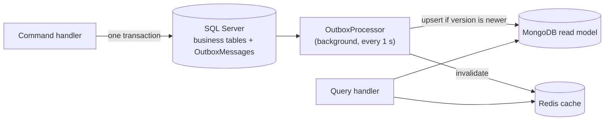

# Building Blocks

Shared technical infrastructure in `src/BuildingBlocks/`. Building blocks contain **no business or domain code** (requirements §51). Every service composes them the same way, so logging, errors, persistence and resilience behave identically across the platform.

| Project | Responsibility | Used by |
|---|---|---|
| `PayNexa.Common` | `Result`/`Error`, Mediator pipeline behaviors, `OperationStep` logging, correlation context, persistence and cache abstractions | Every `*.Application` |
| `PayNexa.Logging` | Serilog setup (Console + Seq + rolling file), correlation ID middleware, request logging, sensitive-data masking | Every host |
| `PayNexa.Observability` | OpenTelemetry tracing/metrics, health endpoints, service-to-service HTTP pipeline (logging + resilience + correlation) | Every host |
| `PayNexa.AspNetCore` | `AddPayNexaServiceDefaults()`: controllers, Problem Details, global exception handler, API versioning, OpenAPI + Scalar | Every `*.API` |
| `PayNexa.SqlServer` | Write store: EF Core registration, SQL command logging, unit of work, transactional outbox + processor, migrations | Every `*.Infrastructure` |
| `PayNexa.MongoDb` | Read store: client registration, command logging, index initialization, version-checked projections | Every `*.Infrastructure` |
| `PayNexa.Caching` | Redis cache-aside (`ICacheService`) with logging; a Redis outage degrades to a cache miss | Every `*.Infrastructure` |
| `PayNexa.Messaging` | Kafka producer/consumer (planned) | — |
| `PayNexa.Vault` | HashiCorp Vault secrets (planned) | — |

---

## 1. Service composition

Every API's `Program.cs` follows the same shape:

```csharp
Log.Logger = PayNexaLogging.CreateBootstrapLogger();

try
{
    var builder = WebApplication.CreateBuilder(args);

    builder.AddPayNexaServiceDefaults();
    builder.Services.AddMediator(options =>
    {
        options.ServiceLifetime = ServiceLifetime.Scoped;
        options.Assemblies = [typeof(SomeCommand)];
        options.PipelineBehaviors = [typeof(LoggingBehavior<,>), typeof(ValidationBehavior<,>)];
    });
    builder.Services.AddCustomerApplication();
    builder.AddCustomerInfrastructure();

    var app = builder.Build();

    app.UsePayNexaServiceDefaults();
    await app.ApplyCustomerDatabaseMigrationsAsync();
    await app.RunAsync();
    return 0;
}
catch (Exception exception) when (exception is not HostAbortedException)
{
    Log.Fatal(exception, "Service terminated unexpectedly during startup");
    return 1;
}
finally
{
    await Log.CloseAndFlushAsync();
}
```

`UsePayNexaServiceDefaults()` installs the middleware in this order: correlation ID → request-started log → Serilog request log → exception handler → status code pages → authorization → controllers → `/health*` → OpenAPI/Scalar (Development only).

The bootstrap logger captures failures before configuration is loaded; `Log.CloseAndFlushAsync()` guarantees the last events reach Seq on shutdown.

---

## 2. Logging

### 2.1 Sinks

| Sink | Format | Purpose |
|---|---|---|
| Console | Text (default) or compact JSON (`PayNexaLogging:ConsoleFormat = Json`) | Local reading and container log collection |
| Seq | Structured events | Search and analysis (`PayNexaLogging:SeqServerUrl`) |
| Rolling file | Compact JSON, daily, 100 MB max, 7 files retained | Durable fallback when Seq is unreachable (`PayNexaLogging:FileDirectory`, default `%TEMP%/paynexa/logs/<service>`) |

Console and file sinks are wrapped in `Serilog.Sinks.Async`; the Seq sink batches asynchronously on its own, so logging never blocks request threads.

### 2.2 Properties on every event

`ServiceName`, `ServiceVersion`, `Environment`, `MachineName`, `ProcessId`, `ThreadId`, `CorrelationId`, `RequestId`, `TraceId`, `SpanId`, `SourceContext`, `EventId`, plus `UserId` once authentication is added. Commands and queries also carry `Operation` and `OperationKind`; steps carry `Step`.

`TraceId`/`SpanId` are captured natively by Serilog from the current OpenTelemetry `Activity`, so Seq can pivot between logs and traces.

### 2.3 What is logged automatically

Nothing below needs code in a handler — it is produced by the building blocks.

| Source | Events |
|---|---|
| Inbound HTTP | `HTTP POST /api/v1/customers started` · `HTTP POST /api/v1/customers responded 201 in 83.21 ms` |
| Command / query (`LoggingBehavior`) | `Command CreateCustomerCommand started` · `… succeeded in N ms` / `… failed in N ms with Customer.NotFound (NotFound)` · `… is slow: N ms exceeds the 500 ms threshold` · `… ended` |
| Validation (`ValidationBehavior`) | `CreateCustomerCommand: Validation started` · `succeeded` / `failed … Reason: 3 validation error(s)` (field names only, never values) · `ended` |
| SQL Server (EF Core interceptor) | `SQL Server INSERT on CustomerDb started (SaveChanges)` · `succeeded in N ms` / `failed` — parameter values are never logged |
| MongoDB (driver command events) | `MongoDB find on customers started (paynexa_customer)` · `succeeded in N ms` / `failed` |
| Redis (`ICacheService`) | `Redis GET started` · `succeeded` with `CacheKey`, `CacheHit` · `ended` — failures logged as Warning and treated as a miss |
| Outbox processor | `Outbox.CustomerCreatedIntegrationEvent: Dispatch … started / succeeded / failed / ended`, retry scheduling, dead-lettering |
| Service-to-service HTTP | `payment-service -> customer-service GetCustomer started (GET /api/v1/customers/{id})` · `succeeded: … responded 200 in N ms after 1 attempt(s)` / `failed …` · `ended` |
| Resilience | `attempt 2 failed with HTTP 503; retrying in 498 ms` · `Circuit OPENED for customer-service …; customer-service is considered down` · `HALF-OPEN` · `CLOSED` |
| Exceptions | `Unhandled InvalidOperationException mapped to HTTP 500 (Server.Unexpected)` |

### 2.4 Steps inside a handler

Use `OperationStep` for meaningful business steps. It logs `started`, then `succeeded`/`failed` with `DurationMs`, then `ended`. Disposing without an outcome is logged as a failure, so an abandoned step is never reported as healthy.

```csharp
using (var step = logger.BeginStep("Email uniqueness check"))
{
    if (await customers.EmailExistsAsync(customer.Email, cancellationToken))
    {
        step.Failed("Email already registered");
        return CustomerErrors.EmailAlreadyRegistered;
    }

    step.Succeeded();
}
```

Add structured properties with `step.WithProperty("CustomerId", id)`. Never pass secrets or raw personal data.

### 2.5 Log levels (requirements §42)

| Level | Used for |
|---|---|
| Debug | Health/OpenAPI requests, background polling queries |
| Information | Lifecycle events: started, succeeded, ended, business events |
| Warning | Expected failures (validation, not found, conflict, business rule), slow operations, retries, tolerated cache outages |
| Error | Unexpected exceptions, 5xx responses, downstream services unavailable, circuit opened |
| Critical | Outbox messages dead-lettered, process-level crashes |

### 2.6 Event IDs

| Range | Area |
|---|---|
| 1000–1099 | Command/query lifecycle |
| 1100–1199 | Steps (`OperationStep`) |
| 2000–2099 | Inbound HTTP and correlation |
| 3000–3099 | Service-to-service calls, retries, circuit breaker |
| 4000–4099 | MongoDB |
| 4100–4199 | Redis |
| 4200–4299 | SQL Server and outbox |
| 5000–5099 | Exceptions |
| 10000+ | Service business events (Customer: 10001 created, 10002 updated) |

### 2.7 Sensitive data (requirements §44)

`SensitiveDataMaskingEnricher` runs on every event, including nested objects:

- Properties whose names contain `password`, `secret`, `token`, `apikey`, `authorization`, `credential`, `cardnumber`, `cvv`, `cvc`, `connectionstring`, `privatekey` → `***REDACTED***`.
- `*Email*` → `r***@example.com`; `*Phone*` → `*********1234`.

Request and response bodies and SQL parameter values are never logged.

### 2.8 Correlation ID (requirements §21)

- Header `X-Correlation-Id`. A client value is accepted if it is at most 64 characters of `[A-Za-z0-9-_.:]`; otherwise a new ID is generated and a warning is logged (the rejected value is not logged).
- The ID is echoed in the response header, added to every log event, tagged on the trace (`correlation.id`), included in Problem Details, stored with outbox messages and restored when they are processed, and forwarded on outbound HTTP calls.
- In Seq, `CorrelationId = 'demo-create-001'` reconstructs the whole flow, including background outbox processing.

---

## 3. Errors and exceptions

### 3.1 Expected failures — `Result<T>`

Handlers return `Result<T>` for expected failures and never throw for them. The API maps the error type to a status code:

| `ErrorType` | HTTP |
|---|---|
| Validation | 400 (with field `errors`) |
| Unauthorized | 401 |
| Forbidden | 403 |
| NotFound | 404 |
| Conflict | 409 |
| BusinessRule | 422 |
| Unavailable | 503 |
| Failure | 500 |

### 3.2 Unexpected failures — global exception handler

`GlobalExceptionHandler` (`IExceptionHandler`) logs each exception exactly once (the pipeline marks exceptions it already logged) and returns a safe Problem Details response:

| Exception | HTTP | `errorCode` |
|---|---|---|
| `DownstreamServiceException` (timeout) | 504 | `Dependency.Timeout` |
| `DownstreamServiceException` (circuit open / unreachable) | 503 | `Dependency.Unavailable` |
| `BadHttpRequestException` | 400 | `Request.Invalid` |
| Anything else | 500 | `Server.Unexpected` |
| Client disconnected | 499 (not logged as an error) | — |

Unhandled exceptions outside HTTP requests (`AppDomain.UnhandledException`, `TaskScheduler.UnobservedTaskException`) are logged at Critical/Error.

### 3.3 Problem Details contract (requirements §28)

```json
{
  "type": "https://tools.ietf.org/html/rfc9110#section-15.5.10",
  "title": "Request conflicts with the current state",
  "status": 409,
  "detail": "A customer with this email address already exists.",
  "instance": "/api/v1/customers",
  "traceId": "117ba9d26578b33dce0dddf96eb83388",
  "correlationId": "01a0d7759f7a7123a0ac3bf6817361c6",
  "errorCode": "Customer.EmailAlreadyRegistered"
}
```

Stack traces and internal messages are never returned to clients.

---

## 4. Write store, read store and outbox (requirements §5.1)



- **Writes** use `IUnitOfWork` + `IOutbox`. The outbox row is saved in the same SQL transaction as the business change.
- `EfUnitOfWork` translates SQL errors: duplicate key → `UniqueConstraintViolationException`, stale row version → `ConcurrencyConflictException`.
- **`OutboxProcessor`** claims pending rows with `UPDLOCK, READPAST` (safe with several instances), dispatches them to every registered `IOutboxMessageHandler<T>`, and marks them processed.
- **Failures** are retried with exponential backoff (2 s, 4 s, 8 s … capped at 5 minutes). After 20 attempts the message is dead-lettered and logged at Critical. To replay: set `Attempts = 0, NextAttemptAtUtc = NULL` on the row.
- **Projections** use `UpsertIfNewerAsync`, which only applies a document whose `Version` is newer, so replays and out-of-order delivery are safe.
- **Money** is always read from SQL Server, never from a projection or cache.
- All `DateTime` values are stored and read as UTC (`UseUtcDateTimes()` convention); an unspecified kind is rejected.

Registering a projection:

```csharp
builder.AddPayNexaSqlServer<CustomerDbContext>(CustomerDbContext.ConnectionStringName, CustomerDbContext.Schema);
services.AddOutboxHandler<CustomerCreatedIntegrationEvent, CustomerProjectionHandler>();
```

Every `DbContext` must call `modelBuilder.ApplyOutbox()` and `configurationBuilder.UseUtcDateTimes()`.

### Migrations (code first)

`dotnet-ef` is pinned in `dotnet-tools.json`:

```powershell
dotnet tool restore
cd src/Services/Customer
dotnet ef migrations add <Name> --project Customer.Infrastructure --startup-project Customer.Infrastructure --output-dir Persistence/Migrations
```

Remove the generated comment lines from the migration files (project rule: no comments). Migrations are applied at startup only when `SqlServer:ApplyMigrationsOnStartup = true` (Development and docker-compose); other environments apply them from the CI/CD pipeline.

---

## 5. Service-to-service calls (requirements §19, §26)

```csharp
services.AddServiceClient<ICustomerClient, CustomerClient>("customer-service", new Uri("http://customer.api:8080"));
```

Handler pipeline, outermost first:

1. `ServiceCallLoggingHandler` — one lifecycle per call, including total duration across retries and attempt count; converts circuit-open, timeout and connection failures into `DownstreamServiceException` (503/504).
2. Standard resilience handler (`Microsoft.Extensions.Http.Resilience`) — total and per-attempt timeouts, retry with exponential backoff and jitter (**only for safe HTTP methods**; financial POSTs are never blindly retried), circuit breaker. Every retry and circuit transition is logged and counted.
3. `OutboundAttemptHandler` — counts attempts and forwards `X-Correlation-Id`.
4. OpenTelemetry HTTP instrumentation — child span per attempt, W3C `traceparent` propagation.

Name the operation per request so logs read well: `new HttpRequestMessage(...).WithOperation("GetCustomer")`.

Metrics (meter `PayNexa.ServiceCalls`): `paynexa.service_call.duration`, `paynexa.service_call.failures`, `paynexa.service_call.retries`, `paynexa.service_call.circuit_opened` — the alerting pipeline (§25) fires on failures and circuit openings.

---

## 6. Health checks (requirements §24)

| Endpoint | Includes |
|---|---|
| `/health/live` | Process only (`self`) |
| `/health/ready` | SQL Server, MongoDB, Redis (Redis reports *Degraded*, not *Unhealthy*, because reads fall back to MongoDB) |
| `/health` | Everything |

Responses are JSON: overall status, total duration and per-check status/duration.

---

## 7. Configuration reference

| Key | Default | Notes |
|---|---|---|
| `Service:Name` | — (required) | Appears on every log event and trace |
| `ConnectionStrings:<Service>Db` | — (required) | Secret: from environment/Vault, never appsettings |
| `MongoDb:ConnectionString`, `MongoDb:DatabaseName` | — (required) | Validated at startup |
| `Redis:ConnectionString` | — (required) | Validated at startup |
| `SqlServer:ApplyMigrationsOnStartup` | `false` | `true` only in Development/compose |
| `Outbox:PollingInterval` / `BatchSize` / `MaxAttempts` / `MaxRetryDelay` | `1 s` / `50` / `20` / `5 min` | Validated at startup |
| `OperationLogging:SlowOperationThresholdMs` | `500` | Slow command/query warning |
| `PayNexaLogging:SeqServerUrl` | empty (Seq disabled) | `http://seq:5341` in compose |
| `PayNexaLogging:ConsoleFormat` | `Text` | `Json` for log collectors |
| `PayNexaLogging:FileDirectory` / `RetainedFileCount` | temp dir / `7` | Rolling file fallback |
| `Observability:OtlpTracesEndpoint` / `OtlpMetricsEndpoint` | empty | Seq accepts traces at `/ingest/otlp/v1/traces` |
| `Serilog:MinimumLevel:Override:<Category>` | — | Per-category level overrides |

Missing required configuration fails the service at startup with a clear message.

---

## 8. Adding a new service — checklist

1. Projects follow `src/Services/<Service>/<Service>.{API,Application,Domain,Infrastructure,Contracts}` with `<RootNamespace>PayNexa.<Services>.<Layer></RootNamespace>` (plural bounded-context namespace avoids `Customer` class/namespace clashes).
2. `Program.cs` uses the composition shown in §1; `appsettings.json` sets `Service:Name`.
3. `DbContext` calls `ApplyOutbox()` and `UseUtcDateTimes()`; register with `AddPayNexaSqlServer<T>()`.
4. Commands write through repositories + `IOutbox` + `IUnitOfWork`; queries read from MongoDB read models (money from SQL Server).
5. Register projections with `AddOutboxHandler<TEvent, THandler>()` and indexes with `AddMongoIndexes<T>()`.
6. Handlers return `Result<T>`; add a validator per command/query.
7. Add unit tests in `tests/Unit/<Service>.UnitTests` and a service document in `doc/<Service>.md`.
