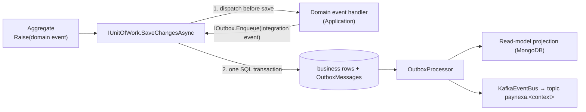

# Building Blocks

Shared technical infrastructure in `src/BuildingBlocks/`. Building blocks contain **no business or domain code** (requirements §51). Every service composes them the same way, so logging, errors, persistence, messaging and resilience behave identically across the platform.

| Project | Responsibility | Referenced by |
|---|---|---|
| `PayNexa.SharedKernel` | DDD base types (`Entity<TId>`, `AggregateRoot<TId>`, `ValueObject`, `StronglyTypedId`, `DomainEvent`, `DomainException`) and `Result`/`Error` | Every `*.Domain` |
| `PayNexa.Common` | Mediator pipeline behaviors, `OperationStep` logging, correlation context, pagination/sorting, domain-event dispatch, persistence/cache/initialization abstractions, `ValidationMessages` | Every `*.Application` |
| `PayNexa.Messaging.Abstractions` | `IIntegrationEvent`, `[IntegrationEvent]`, `IEventBus`, message headers, serializer — no dependencies | Every `*.Contracts` |
| `PayNexa.Messaging` | Kafka event bus, outbox → Kafka publishing, topic creation, health check | Every `*.Infrastructure` |
| `PayNexa.Logging` | Serilog (Console + Seq + rolling file), correlation middleware, request logging, masking | Every host |
| `PayNexa.Observability` | OpenTelemetry, health endpoints, service-to-service HTTP pipeline | Every host |
| `PayNexa.AspNetCore` | `AddPayNexaServiceDefaults()`, Problem Details, exception handler, versioning, OpenAPI + Swagger UI, `InitializeInfrastructureAsync()`, paging query parameters | Every `*.API` |
| `PayNexa.SqlServer` | Write store: EF Core, command logging, unit of work (+ domain events), transactional outbox, migrations initializer, EF paging | Every `*.Infrastructure` |
| `PayNexa.MongoDb` | Read store: client, command logging, collection/index initializer, version-checked projections, Mongo paging | Every `*.Infrastructure` |
| `PayNexa.Caching` | Redis cache-aside (`ICacheService`); an outage degrades to a cache miss | Every `*.Infrastructure` |
| `PayNexa.Vault` | HashiCorp Vault secrets (planned) | — |

Dependency direction: `Domain → SharedKernel` · `Contracts → Messaging.Abstractions` · `Application → Common, Domain, Contracts` · `Infrastructure → Application + SqlServer/MongoDb/Caching/Messaging` · `API → AspNetCore + Application + Infrastructure`. Domain and Application never see a database, cache or broker type — only abstractions (Dependency Inversion).

---

## 1. Service composition (dependency injection per layer)

Each layer owns a `DependencyInjection.cs`, and `Program.cs` composes them (the Dinner_Host pattern):

```csharp
Log.Logger = PayNexaLogging.CreateBootstrapLogger();

try
{
    var builder = WebApplication.CreateBuilder(args);
    {
        builder.Services
            .AddPresentation(builder.Configuration, builder.Environment)
            .AddApplication()
            .AddInfrastructure(builder.Configuration);
    }

    var app = builder.Build();
    {
        app.UsePresentation();
        await app.InitializeInfrastructureAsync();
        await app.RunAsync();
    }

    return 0;
}
catch (Exception exception) when (exception is not HostAbortedException)
{
    Log.Fatal(exception, "Service terminated unexpectedly during startup");
    return 1;
}
finally
{
    await Log.CloseAndFlushAsync();
}
```

| Layer | Method | Registers |
|---|---|---|
| API | `AddPresentation` / `UsePresentation` | Service defaults (logging, observability, Problem Details, controllers, versioning, OpenAPI, Swagger) and Mediator with the pipeline `LoggingBehavior → ValidationBehavior → DomainRuleBehavior` |
| Application | `AddApplication` | FluentValidation validators and domain-event handlers found in the assembly |
| Infrastructure | `AddInfrastructure` | Composed from `AddWriteStore`, `AddReadStore`, `AddCaching`, `AddMessaging` |

---

## 2. Domain model (DDD)

```text
Customer.Domain/
├── CustomerAggregate/
│   ├── Customer.cs                          AggregateRoot<CustomerId>
│   ├── ValueObjects/  CustomerId, PersonName, Email, PhoneNumber, Address, StatusReason
│   ├── Enums/         CustomerStatus, KycStatus
│   ├── Policies/      CustomerPolicy (minimum age)
│   ├── Events/        one domain event per behavior
│   └── PaymentEligibility.cs
└── Common/Errors/
    ├── Errors.Customer.cs                   static partial class Errors { static class Customer { ... } }
    ├── CustomerErrorCodes.cs                constants
    └── CustomerErrorMessages.cs             constants
```

SharedKernel base types:

| Type | What it gives every aggregate / value object |
|---|---|
| `Entity<TId>` | Identity-based equality |
| `AggregateRoot<TId>` | Domain events (`Raise`, `DequeueDomainEvents`), **`CreatedAtUtc`, `CreatedBy`, `UpdatedAtUtc`, `UpdatedBy`, `Version`** |
| `ValueObject` | Structural equality from `GetEqualityComponents()` |
| `SingleValueObject<T>` | One-value objects (`Email`, `PhoneNumber`, `StatusReason`) — `Value`, equality, `ToString()` |
| `StronglyTypedId` | `SingleValueObject<Guid>` for ids (`CustomerId.CreateUnique()`, `CustomerId.Create(guid)`) |
| `DomainException(Error)` | Invariant violation carrying a typed `Error`; `DomainRuleBehavior` turns it into a failed `Result` |

- Aggregates expose behavior (`Register`, `Suspend`, `VerifyKyc`, …) instead of setters and never touch audit fields or `Version`.
- Errors are defined once per aggregate in `Errors.<Aggregate>` from `*ErrorCodes` / `*ErrorMessages` constants.

### 2.1 Automatic auditing and versioning

`IUnitOfWork.SaveChangesAsync` runs `AuditStamper` **before** domain events are dispatched, so events, snapshots and API responses already see the final values:

| Change | Stamped |
|---|---|
| Added | `CreatedAtUtc`, `CreatedBy`, `UpdatedAtUtc`, `UpdatedBy`, `Version = 1` |
| Modified (property, owned type or raised domain event) | `UpdatedAtUtc`, `UpdatedBy`, `Version + 1` (the original value stays the concurrency check) |

The actor comes from `ICurrentActor`: the JWT `sub` claim (or `anonymous`) inside an HTTP request, `system` for seeding and background work. Time comes from `TimeProvider`.

### 2.2 Persistence conventions

Every `DbContext` calls, in `OnModelCreating`:

```csharp
modelBuilder.HasDefaultSchema(Schema);
modelBuilder.ApplySingleValueObjectConversions();
modelBuilder.ApplyConfigurationsFromAssembly(typeof(CustomerDbContext).Assembly);
modelBuilder.ApplyAuditingConventions();
modelBuilder.ApplyOutbox();
```

| Convention | Effect |
|---|---|
| `ApplySingleValueObjectConversions` | Every `SingleValueObject<T>`/`StronglyTypedId` property becomes a column of `T` through a compiled converter (no per-property `HasConversion`); reading from the database bypasses re-validation |
| `ApplyAuditingConventions` | `datetime2(3)` audit timestamps, `CreatedBy`/`UpdatedBy` `nvarchar(100)`, `Version` concurrency token, `DomainEvents` ignored |
| `UseUtcDateTimes` (in `ConfigureConventions`) | Every `DateTime` is stored and read as UTC |

Entity configurations therefore only describe what is specific (lengths, indexes, owned/complex types).

---

## 3. API conventions and mapping

### 3.1 Controllers

One controller per resource, split into partial files by concern: `CustomersController.cs` (queries), `.Profile.cs`, `.Status.cs`, `.Kyc.cs`. Actions are one-liners: map the request, send it, and let the base turn the `Result` into HTTP.

```csharp
namespace PayNexa.Customers.API.Controllers.V1;

public sealed partial class CustomersController
{
    [HttpPost]
    public Task<ActionResult<CustomerResponse>> Register(
        RegisterCustomerRequest request,
        CancellationToken cancellationToken) =>
        CreateAsync(request.ToCommand(), nameof(GetById), customer => customer.Id, cancellationToken);

    [HttpPost(ApiRoutes.ByIdAction)]
    public Task<ActionResult<CustomerResponse>> Suspend(
        Guid id,
        CustomerStatusChangeRequest request,
        CancellationToken cancellationToken) =>
        CommandAsync(request.ToSuspendCommand(id), cancellationToken);
}
```

| Concern | Where it comes from |
|---|---|
| `api/v{version}/[controller]` | `[Route(ApiRoutes.Resource)]` on `ApiControllerBase` |
| Action routes | `ApiRoutes` (`ById`, `Action`, `ByIdAction`) in AspNetCore; service-specific segments in `<Service>.API/Routing` (e.g. `CustomerRoutes.Email`, `CustomerRoutes.KycAction`) — never inline strings |
| API version | Namespace `Controllers.V1` (`VersionByNamespaceConvention`) |
| URL casing | `KebabCaseParameterTransformer` (`PaymentEligibility` → `payment-eligibility`) and lowercase URLs |
| Response types in OpenAPI | `ProblemDetailsResponseConvention`: success type from `ActionResult<T>`; 201 for create, 200/204 otherwise; 400 validation; 404 when the route targets a resource; 409/422 for commands; 500 always |
| Sending | `QueryAsync` (`IQuery<Result<T>>`), `CommandAsync` (`ICommand<Result<T>>`), `CreateAsync` (201 + `Location` built from the id and current version); `ISender` is resolved by the base, so controllers have no constructor |
| Result → HTTP | `Respond` / `RespondCreated` (`Result` failures become Problem Details) |

### 3.2 Request models

- **Bodies**: records in `*.Contracts/Requests` (shared with other services).
- **Query strings**: API-layer classes in `Requests`, bound with `[FromQuery]` and mapped to a query by Mapperly. Paged lists derive from `PagedRequest` (`page`, `page-size`, `search`, `sort-by`, `sort-order`) plus service filters, e.g. `ListCustomersRequest` adds `status`, `kyc-status`; single lookups are plain classes, e.g. `CustomerLookupRequest` (`email`).

```text
ListCustomersRequest (API, [FromQuery])  →  ListCustomersQuery (Application)  →  handler  →  MongoDB read model
```

### 3.3 Mapping (Riok.Mapperly)

Mapperly (Apache-2.0) generates mapping code at compile time: no reflection, full IntelliSense, and — with `RequiredMappingStrategy.Target` plus warnings-as-errors — **an unmapped target member fails the build**.

| Layer | Mapper | Maps |
|---|---|---|
| API | `CustomerRequestMapper` | HTTP request (+ route id) → command / query |
| Application | `CustomerMapper` | Aggregate → `CustomerResponse` / `CustomerSnapshot`; value objects → primitives |
| Infrastructure | `CustomerReadModelMapper` | Snapshot → MongoDB read model → response |

Primitive → value object conversions go through the value objects' `Create` factories (validation stays in the domain).

---

## 4. Events



| Kind | Where | Purpose |
|---|---|---|
| Domain event | `*.Domain/.../Events`, derives `DomainEvent` | Something happened inside the aggregate; handled in-process before the transaction commits |
| Integration event | `*.Contracts/Events`, implements `IIntegrationEvent`, `[IntegrationEvent("customer.created", version: 1)]` | Published to other services through the outbox and Kafka |

Why this is safer than publishing directly from a handler:

- The integration event is committed **in the same SQL transaction** as the state change — no lost or phantom events when the broker or the process fails.
- `EventId` and `OccurredAtUtc` are **stable values** captured once (the domain event's identity becomes the integration event's identity), so consumers can deduplicate.
- Messages are **keyed by aggregate id**, so all events of one customer stay ordered on one partition.
- Payloads never carry secrets or card data; the partition key is transport metadata and is stripped from the JSON automatically.

### Kafka conventions

| Item | Convention |
|---|---|
| Topic | `paynexa.<bounded context>` derived from the event type (`customer.created` → `paynexa.customer`); override with `[IntegrationEvent(..., Topic = "...")]` |
| Key | `IIntegrationEvent.PartitionKey` (aggregate id) |
| Value | JSON (camelCase, enums as strings) |
| Headers | `event-id`, `event-type`, `event-version`, `occurred-at-utc`, `content-type`, `source-service`, `correlation-id`, `traceparent` |
| Producer | Idempotent, `acks=all`, LZ4 compression, 10 s delivery timeout (the outbox retries afterwards) |
| Topics | Created at startup in Development (`Kafka:AutoCreateTopics`), 3 partitions; broker auto-creation is disabled |

Registering in Infrastructure:

```csharp
services
    .AddPayNexaKafka(configuration)
    .AddIntegrationEventPublishing<CustomerCreatedIntegrationEvent>()
    .AddIntegrationEventPublishing<CustomerUpdatedIntegrationEvent>();
```

Consumers (inbox idempotency, retry and dead-letter topics, requirements §46) are added with the first consuming service.

---

## 5. Pagination and sorting

| Type | Layer | Role |
|---|---|---|
| `PageRequest(Page, PageSize)` | Common | Defaults (1, 20), max page size 100, `Skip` |
| `PagedResult<T>` | Common | `items`, `page`, `pageSize`, `totalCount`, `totalPages`, `hasPreviousPage`, `hasNextPage`, `Map()` |
| `SortRequest<TField>` / `SortDirection` | Common | Resolved sort instruction |
| `SortFieldMap<TField>` | Common | Maps API names (`created-at`) to a typed field, with a default sort and case-insensitive parsing |
| `QueryParameterNames` | Common | `page`, `page-size`, `sort-by`, `sort-order`, `search` — shared by binding and validation |
| `RuleForPage`, `ValidSearch`, `ValidSortField`, `ValidSortOrder` | Common | Reusable FluentValidation rules; errors are reported under the query-parameter name |
| `PagedRequest` | AspNetCore | Base `[FromQuery]` model (`page`, `page-size`, `search`, `sort-by`, `sort-order`) for API query DTOs |
| `ValidEnumFilter`, `ParseEnumFilter` | Common | Case-insensitive enum filters (`status=suspended`) |
| `ToPagedResultAsync` | MongoDb / SqlServer | One call to count + page + map for MongoDB collections and EF queries |

Controller → query → store:

```csharp
[HttpGet]
public Task<ActionResult<PagedResult<CustomerResponse>>> List(
    [FromQuery] ListCustomersRequest request,
    CancellationToken cancellationToken) =>
    QueryAsync(request.ToQuery(), cancellationToken);
```

```csharp
customers.ToPagedResultAsync(filter, sort, criteria.Page, model => model.ToResponse(), cancellationToken);
```

---

## 6. Startup initialization (database-agnostic)

`app.InitializeInfrastructureAsync()` runs every registered `IInfrastructureInitializer` in order, then — in Development only — every `IDataSeeder`:

| Order | Initializer | What it does |
|---|---|---|
| 100 | `SqlServerMigrationInitializer<T>` | Creates the database if missing and applies pending EF migrations (Development, or `SqlServer:ApplyMigrationsOnStartup = true`); retries while SQL Server starts |
| 200 | `MongoIndexInitializer` | Creates collections and indexes (all environments, idempotent) |
| 300 | `KafkaTopicInitializer` | Creates missing topics for published events (Development, or `Kafka:AutoCreateTopics = true`) |
| — | `IDataSeeder` (e.g. `CustomerDataSeeder`) | Seeds data **only when the store is empty**, through the domain model — so seeding also raises events, fills read models and publishes to Kafka |

Startup code never references EF Core, MongoDB or Kafka directly; adding a new store means registering another initializer.

---

## 7. Logging

### 7.1 Sinks

| Sink | Format | Purpose |
|---|---|---|
| Console | Text (default) or compact JSON (`PayNexaLogging:ConsoleFormat = Json`) | Local reading and container log collection |
| Seq | Structured events | Search and analysis (`PayNexaLogging:SeqServerUrl`) |
| Rolling file | Compact JSON, daily, 100 MB max, 7 files retained | Durable fallback when Seq is unreachable (`PayNexaLogging:FileDirectory`) |

### 7.2 Properties on every event

`ServiceName`, `ServiceVersion`, `Environment`, `MachineName`, `ProcessId`, `ThreadId`, `CorrelationId`, `RequestId`, `TraceId`, `SpanId`, `SourceContext`, `EventId`; commands and queries add `Operation`/`OperationKind`, steps add `Step`.

### 7.3 What is logged automatically

| Source | Events |
|---|---|
| Inbound HTTP | `HTTP POST /api/v1/customers started` · `… responded 201 in 83.21 ms` |
| Command / query | `Command CreateCustomerCommand started` · `succeeded` / `failed with Customer.NotFound (NotFound)` · `is slow` · `ended` |
| Validation | `Validation started` · `succeeded` / `failed … Reason: 3 validation error(s)` (field names only) · `ended` |
| Domain events | `Handle domain event CustomerRegisteredDomainEvent started / succeeded / ended` |
| SQL Server | `SQL Server INSERT on CustomerDb started (SaveChanges)` · `succeeded in N ms` / `failed` |
| MongoDB | `MongoDB update on customers started` · `succeeded in N ms` / `failed` |
| Redis | `Redis GET started` · `succeeded` (`CacheKey`, `CacheHit`) · `ended` |
| Outbox | `Dispatch CustomerCreatedIntegrationEvent started / succeeded / failed / ended`, retries, dead-lettering |
| Kafka | `Kafka publish customer.created to paynexa.customer started` · `succeeded` (`Partition`, `Offset`) · `ended` |
| Service-to-service HTTP | `payment-service -> customer-service GetCustomer started / succeeded / failed / ended`, attempts |
| Resilience | retries, circuit OPENED / HALF-OPEN / CLOSED |
| Startup | `Initialize CustomerDbContext migrations`, `Initialize Kafka topics`, `Seed Customers` |

### 7.4 Steps inside a handler

```csharp
using (var step = logger.BeginStep("Email uniqueness check"))
{
    if (await customers.EmailExistsAsync(email, cancellationToken))
    {
        step.Failed(CustomerErrorCodes.EmailAlreadyRegistered);
        return Errors.Customer.EmailAlreadyRegistered;
    }

    step.Succeeded();
}
```

### 7.5 Levels and event ids

| Level | Used for |
|---|---|
| Debug | Health/OpenAPI/Swagger requests, background polling queries |
| Information | Lifecycle: started, succeeded, ended, business events |
| Warning | Expected failures, slow operations, retries, tolerated cache/broker outages |
| Error | Unexpected exceptions, 5xx, downstream unavailable, circuit opened |
| Critical | Dead-lettered outbox messages, process crashes |

| Range | Area |
|---|---|
| 1000 / 1100 | Operations / steps |
| 2000 | Inbound HTTP and correlation |
| 3000 | Service-to-service calls and resilience |
| 4000 / 4100 / 4200 / 4300 | MongoDB / Redis / SQL Server + outbox / Kafka |
| 5000 | Exceptions |
| 10000+ | Service business events |

### 7.6 Sensitive data and correlation

- Properties named like `password`, `secret`, `token`, `apikey`, `authorization`, `credential`, `cardnumber`, `cvv`, `connectionstring`, `privatekey` are redacted; `*Email*` and `*Phone*` are partially masked — including nested objects.
- `X-Correlation-Id` is accepted (validated) or generated, echoed in the response, added to every log event, tagged on traces, stored with outbox messages, sent as a Kafka header and forwarded on outbound HTTP calls.

---

## 8. Errors and exceptions

| `ErrorType` | HTTP |
|---|---|
| Validation | 400 (with field `errors`) |
| Unauthorized / Forbidden | 401 / 403 |
| NotFound | 404 |
| Conflict | 409 |
| BusinessRule | 422 |
| Unavailable | 503 |
| Failure | 500 |

| Exception (global handler) | HTTP | `errorCode` |
|---|---|---|
| `DownstreamServiceException` (timeout) | 504 | `Dependency.Timeout` |
| `DownstreamServiceException` (circuit open / unreachable) | 503 | `Dependency.Unavailable` |
| `BadHttpRequestException` | 400 | `Request.Invalid` |
| Anything else | 500 | `Server.Unexpected` |

All titles and messages come from `CommonErrorMessages`, `ValidationMessages` and each service's `*ErrorMessages`. Responses are RFC 9457 Problem Details with `traceId`, `correlationId` and `errorCode`; stack traces are never returned.

---

## 9. Write store, read store, cache

- Writes go through repositories + `IUnitOfWork` into SQL Server; `EfUnitOfWork` dispatches domain events, then saves, and translates duplicate keys / stale versions into `UniqueConstraintViolationException` / `ConcurrencyConflictException`.
- `OutboxProcessor` claims rows with `UPDLOCK, READPAST`, runs every `IOutboxMessageHandler<T>` (projection, Kafka publisher, …), retries with exponential backoff up to 5 minutes, dead-letters after 20 attempts.
- Projections use `UpsertIfNewerAsync` (version-checked, replay-safe) and then invalidate the Redis entry.
- All `DateTime` values are UTC end to end (`UseUtcDateTimes()`).
- Money is always read from SQL Server (requirements §5.1).

Migrations are code first (`dotnet tool restore`, then `dotnet ef migrations add <Name> --project <Service>.Infrastructure --startup-project <Service>.Infrastructure --output-dir Persistence/Migrations`); remove the generated comment lines.

---

## 10. Service-to-service calls

```csharp
services.AddServiceClient<ICustomerClient, CustomerClient>("customer-service", new Uri("http://customer.api:8080"));
```

Pipeline: `ServiceCallLoggingHandler` → standard resilience (timeouts, retry with jitter for safe methods only, circuit breaker) → `OutboundAttemptHandler` (attempt count, `X-Correlation-Id`) → OpenTelemetry. Failures surface as `DownstreamServiceException` (503/504). Metrics: `paynexa.service_call.duration|failures|retries|circuit_opened`.

---

## 11. Health checks

| Endpoint | Includes |
|---|---|
| `/health/live` | Process only |
| `/health/ready` | SQL Server, MongoDB (unhealthy when down), Redis and Kafka (degraded when down — reads fall back / events wait in the outbox) |
| `/health` | Everything |

---

## 12. Ports, Swagger and Docker

| Service | HTTPS | HTTP | Swagger (Development) |
|---|---|---|---|
| API Gateway | 6000 | 5000 | — (`/health`) |
| Customer | 6001 | 5001 | https://localhost:6001/swagger |
| Authentication | 6002 | 5002 | https://localhost:6002/swagger |
| Payment | 6003 | 5003 | https://localhost:6003/swagger |
| Transaction | 6004 | 5004 | https://localhost:6004/swagger |
| Notification | 6005 | 5005 | https://localhost:6005/swagger |

- The same ports are used by `dotnet run` / F5 (`launchSettings.json`, Swagger opens automatically) and by Docker (containers listen on 8080/8081, mapped to these ports).
- Containers serve HTTPS with the ASP.NET Core development certificate exported to `%APPDATA%\ASP.NET\Https\paynexa-dev.pfx` (password `DEV_CERT_PASSWORD` in `src/.env`):

  ```powershell
  dotnet dev-certs https --trust
  dotnet dev-certs https -ep "$env:APPDATA\ASP.NET\Https\paynexa-dev.pfx" -p <DEV_CERT_PASSWORD>
  ```

---

## 13. Configuration reference

| Key | Default | Notes |
|---|---|---|
| `Service:Name` | — (required) | Log events, traces, Kafka `source-service` header |
| `ConnectionStrings:<Service>Db` | — (required) | Server, database and user only — **no password** (Development value in `appsettings.Development.json`) |
| `SqlServer:Password` | — | Secret, merged into the connection string at startup: user-secrets locally (`dotnet user-secrets set SqlServer:Password <value> --project <Service>.API`), `SQL_SA_PASSWORD` from `.env` in Docker, Vault later |
| `MongoDb:ConnectionString` / `DatabaseName` | — (required) | Validated at startup |
| `Redis:ConnectionString` | — (required) | Validated at startup |
| `Kafka:BootstrapServers` | — (required) | `kafka:29092` in Docker, `localhost:9092` on the host |
| `Kafka:AutoCreateTopics` | Development | `TopicPartitions` 3, `TopicReplicationFactor` 1, `MessageTimeoutMs` 10000 |
| `SqlServer:ApplyMigrationsOnStartup` | Development | Other environments migrate from CI/CD |
| `Outbox:PollingInterval` / `BatchSize` / `MaxAttempts` / `MaxRetryDelay` | 1 s / 50 / 20 / 5 min | Validated |
| `OperationLogging:SlowOperationThresholdMs` | 500 | |
| `<Service>:*` | per service | Service-specific settings, e.g. `Customer:MinimumAgeYears`, `Customer:ProfileCacheTimeToLive`, `Jwt:*`, `Payment:*` — bound to validated options classes |
| `ReverseProxy:Routes` / `Clusters` | gateway | YARP routes (`/api/v1/{auth,customers,payments,transactions}/**`) and service addresses (localhost ports in Development, container names in Docker) |
| `PayNexaLogging:SeqServerUrl` / `ConsoleFormat` / `FileDirectory` | — / Text / temp | |
| `Observability:OtlpTracesEndpoint` / `OtlpMetricsEndpoint` | — | Seq accepts traces at `/ingest/otlp/v1/traces` |

---

## 14. Adding a new service — checklist

1. Projects `src/Services/<Service>/<Service>.{API,Application,Domain,Infrastructure,Contracts}` with `<RootNamespace>PayNexa.<Services>.<Layer></RootNamespace>`.
2. Domain: `<Name>Aggregate/` with a strongly typed id, value objects, enums, domain events; `Common/Errors/Errors.<Name>.cs` + `*ErrorCodes` + `*ErrorMessages`.
3. Application: commands/queries returning `Result<T>`, one validator each, domain-event handlers that enqueue integration events, `AddApplication()`.
4. Contracts: requests/responses and integration events with `[IntegrationEvent]`.
5. Infrastructure: `DbContext` with `ApplySingleValueObjectConversions()`, `ApplyAuditingConventions()`, `ApplyOutbox()` + `UseUtcDateTimes()`, repositories, read store + projections, seeder, `AddInfrastructure()` composed of write store / read store / caching / messaging.
6. API: `DependencyInjection.cs` (`AddPresentation` / `UsePresentation`), controllers in `Controllers/V1` deriving `ApiControllerBase` (no route strings or response attributes), query DTOs deriving `PagedRequest`, Mapperly request mappers, `launchSettings.json` on the assigned ports, service settings in `appsettings*.json`.
7. Docker: Dockerfile, `docker-compose.yml`, `docker-compose.override.yml` (ports, environment, certificate volume), `.env.example`; rebuild and run the containers.
8. Tests in `tests/Unit/<Service>.UnitTests`; document the service in `doc/<Service>.md`.
