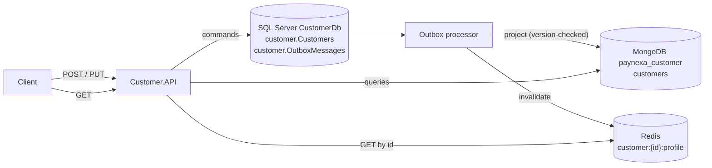

# Customer Service

**Status:** Implemented (v1)
**Service name:** `customer-service` · **Container:** `customer.api` · **Port (compose):** `8002`

Owns customer profiles: registration, profile updates and customer lookup. Payment Service will call it synchronously (REST) to validate a customer before accepting a payment.

---

## 1. Responsibilities

- Register customers with a unique email address.
- Update profile details (first name, last name, phone number). Email and date of birth are immutable after registration.
- Serve customer lookups and paged, searchable, sortable customer lists.
- Publish `customer.created` and `customer.updated` integration events through the transactional outbox.

Out of scope: authentication and credentials (Authentication Service), KYC documents, payments.

---

## 2. Architecture



| Layer | Contents |
|---|---|
| `Customer.Domain` | `Customer` aggregate, `Email` and `PhoneNumber` value objects, `CustomerStatus`, `DomainException` |
| `Customer.Application` | Commands `CreateCustomer`, `UpdateCustomer`; queries `GetCustomerById`, `ListCustomers`; validators; `ICustomerRepository`, `ICustomerReadStore`; cache keys; errors |
| `Customer.Infrastructure` | `CustomerDbContext` + EF configuration + migrations, `CustomerRepository` (SQL), `CustomerReadStore` + `CustomerProjectionHandler` + indexes (MongoDB) |
| `Customer.Contracts` | `CreateCustomerRequest`, `UpdateCustomerRequest`, `CustomerResponse`, integration events — the only project other services may reference |
| `Customer.API` | `CustomersController`, `Program.cs` |

Namespaces use the plural bounded context `PayNexa.Customers.*`.

---

## 3. Data ownership

| Store | Role | Details |
|---|---|---|
| SQL Server `CustomerDb`, schema `customer` | **Write store, source of truth** | `Customers` (unique index on `Email`, index on `CreatedAtUtc`, `Version` concurrency token) and `OutboxMessages` |
| MongoDB `paynexa_customer` | **Read store** | `customers` collection projected from the outbox; indexes on `createdAtUtc`, `lastName`, `firstName`, `email` |
| Redis | Cache in front of the read store | `customer:{customerId:N}:profile`, TTL 10 minutes, invalidated by the projection after every change |

- Writes go to SQL Server only. The API response of a command is built from the write model, so the caller sees its change immediately.
- Reads are eventually consistent: a `GET` right after a write can lag by about one outbox polling interval (1 s).
- The customer service holds no monetary data.

### Customer

| Field | Rules |
|---|---|
| `id` | UUID v7, generated by the service |
| `firstName`, `lastName` | Required, trimmed, max 100 characters |
| `email` | Valid address with a dotted domain, max 254, stored lower-case, unique |
| `phoneNumber` | E.164, e.g. `+8801700000000` |
| `dateOfBirth` | `1900-01-01` to today |
| `status` | `Active` (new customers), `Suspended`, `Closed` — closed customers cannot be updated |
| `createdAtUtc`, `updatedAtUtc` | UTC |
| `version` (internal) | Starts at 1, incremented on every change; optimistic concurrency and projection ordering |

---

## 4. API

Base path: `/api/v1/customers`. JSON properties are camelCase; query parameters are kebab-case (requirements §27). All errors use Problem Details with `traceId`, `correlationId` and `errorCode`. Send `X-Correlation-Id` to trace a request end to end; the response echoes it.

### 4.1 Create customer

```http
POST /api/v1/customers
Content-Type: application/json
```

```json
{
  "firstName": "Saidul Islam",
  "lastName": "Rajib",
  "email": "saidul.is.rajib@gmail.com",
  "phoneNumber": "+8801700000000",
  "dateOfBirth": "1995-05-20"
}
```

**201 Created** with `Location: /api/v1/customers/{id}`:

```json
{
  "id": "01a0d775-8b75-72de-bcab-3c690216124b",
  "firstName": "Saidul Islam",
  "lastName": "Rajib",
  "email": "saidul.is.rajib@gmail.com",
  "phoneNumber": "+8801700000000",
  "dateOfBirth": "1995-05-20",
  "status": "Active",
  "createdAtUtc": "2026-09-25T07:26:39.989Z",
  "updatedAtUtc": "2026-09-25T07:26:39.989Z"
}
```

| Status | `errorCode` | When |
|---|---|---|
| 400 | `Validation.Failed` | Invalid fields (see `errors`) |
| 409 | `Customer.EmailAlreadyRegistered` | Email already registered (also when a concurrent request wins the unique index) |

### 4.2 Get customer by id

```http
GET /api/v1/customers/{id}
```

**200 OK** — same body as above. Served from Redis, then MongoDB.

| Status | `errorCode` | When |
|---|---|---|
| 404 | `Customer.NotFound` | Unknown id (or not yet projected, ~1 s after creation) |

### 4.3 List customers

```http
GET /api/v1/customers?page=1&page-size=20&search=rajib&sort-by=created-at&sort-order=desc
```

| Parameter | Default | Rules |
|---|---|---|
| `page` | `1` | ≥ 1 |
| `page-size` | `20` | 1–100 |
| `search` | — | Case-insensitive match on first name, last name or email; max 100 characters |
| `sort-by` | `created-at` | `created-at`, `first-name`, `last-name`, `email` |
| `sort-order` | `desc` | `asc`, `desc` |

**200 OK**

```json
{
  "items": [ { "id": "01a0d775-…", "firstName": "Saidul Islam", "…": "…" } ],
  "page": 1,
  "pageSize": 20,
  "totalCount": 1,
  "totalPages": 1
}
```

| Status | `errorCode` | When |
|---|---|---|
| 400 | `Validation.Failed` | Invalid paging or sorting value |

### 4.4 Update customer

```http
PUT /api/v1/customers/{id}
Content-Type: application/json
```

```json
{
  "firstName": "Saidul Islam",
  "lastName": "Rajib",
  "phoneNumber": "+8801700000001"
}
```

**200 OK** — the updated customer.

| Status | `errorCode` | When |
|---|---|---|
| 400 | `Validation.Failed` | Invalid fields |
| 404 | `Customer.NotFound` | Unknown id |
| 409 | `Customer.ConcurrentModification` | Changed by another request in the meantime; reload and retry |
| 422 | `Customer.Closed` | The customer is closed |

### 4.5 Operational endpoints

| Endpoint | Purpose |
|---|---|
| `/health`, `/health/live`, `/health/ready` | Health (ready = SQL Server + MongoDB + Redis) |
| `/openapi/v1.json`, `/scalar/v1` | OpenAPI document and API reference (Development only) |

---

## 5. Integration events

Written to the outbox in the same transaction as the change. Today they drive the MongoDB projection; they will also be published to Kafka.

| Event type | Contract | Version |
|---|---|---|
| `customer.created` | `CustomerCreatedIntegrationEvent` | 1 |
| `customer.updated` | `CustomerUpdatedIntegrationEvent` | 1 |

Both carry `eventId`, `occurredAtUtc`, `customerId`, the full customer snapshot, `version` and `eventVersion`. Consumers must ignore events whose `version` is not newer than what they already hold.

---

## 6. Logging

A successful update, filtered in Seq by `CorrelationId = 'demo-update-002'`:

```text
HTTP PUT /api/v1/customers/01a0d775-… started
Command UpdateCustomerCommand started
UpdateCustomerCommand: Validation started
UpdateCustomerCommand: Validation succeeded in 14.23 ms
UpdateCustomerCommand: Validation ended
SQL Server SELECT on CustomerDb started (LinqQuery)
SQL Server SELECT on CustomerDb succeeded in 2.39 ms (LinqQuery)
UpdateCustomerCommand: Persist customer to write store started
SQL Server UPDATE on CustomerDb started (SaveChanges)
SQL Server UPDATE on CustomerDb succeeded in 2.2 ms (SaveChanges)
UpdateCustomerCommand: Persist customer to write store succeeded in 97.22 ms
UpdateCustomerCommand: Persist customer to write store ended
Customer 01a0d775-… updated to version 3
UpdateCustomerCommand succeeded in 532.39 ms
UpdateCustomerCommand ended
HTTP PUT /api/v1/customers/01a0d775-… responded 200 in 604.72 ms
Outbox.CustomerUpdatedIntegrationEvent: Dispatch CustomerUpdatedIntegrationEvent started
Outbox.CustomerUpdatedIntegrationEvent: Project customer to read store started
MongoDB update on customers started (paynexa_customer)
MongoDB update on customers succeeded in 9.42 ms (paynexa_customer)
Outbox.CustomerUpdatedIntegrationEvent: Project customer to read store succeeded in 45.72 ms
Outbox.CustomerUpdatedIntegrationEvent: Redis DEL succeeded in 8.55 ms
Outbox.CustomerUpdatedIntegrationEvent: Dispatch CustomerUpdatedIntegrationEvent succeeded in 144.32 ms
```

Business events: `10001 Customer {CustomerId} created`, `10002 Customer {CustomerId} updated to version {CustomerVersion}`. Email and phone number are masked in every log event.

---

## 7. Configuration

| Key | Example (compose) |
|---|---|
| `Service:Name` | `customer-service` |
| `ConnectionStrings:CustomerDb` | from `.env` (`SQL_SA_PASSWORD`) — never in appsettings |
| `MongoDb:ConnectionString` / `DatabaseName` | `mongodb://mongodb:27017` / `paynexa_customer` |
| `Redis:ConnectionString` | `redis:6379` |
| `SqlServer:ApplyMigrationsOnStartup` | `true` in Development/compose |
| `PayNexaLogging:SeqServerUrl` | `http://seq:5341` |
| `Observability:OtlpTracesEndpoint` | `http://seq:5341/ingest/otlp/v1/traces` |

All shared keys are described in [BuildingBlocks.md](BuildingBlocks.md#7-configuration-reference).

---

## 8. Running and testing

**With Visual Studio:** set `docker-compose` as the startup project and press F5. Scalar opens at `http://localhost:8002/scalar/v1`.

**From the command line (infrastructure in Docker, service on the host):**

```powershell
cd src
docker compose up -d sqlserver mongodb redis seq
$env:ConnectionStrings__CustomerDb = "Server=localhost,1433;Database=CustomerDb;User Id=sa;Password=<SQL_SA_PASSWORD>;TrustServerCertificate=True"
dotnet run --project Services/Customer/Customer.API --launch-profile http
```

Sample requests: `src/Services/Customer/Customer.API/Customer.API.http`.

**Unit tests** (`tests/Unit/Customer.UnitTests`): value objects, aggregate rules, validators, command handlers (success, duplicate email, unique-index race, concurrency conflict, write-store failure) and query handlers (cache hit, cache miss, not found, default sorting).

```powershell
dotnet test --solution src/PayNexa.slnx
```
