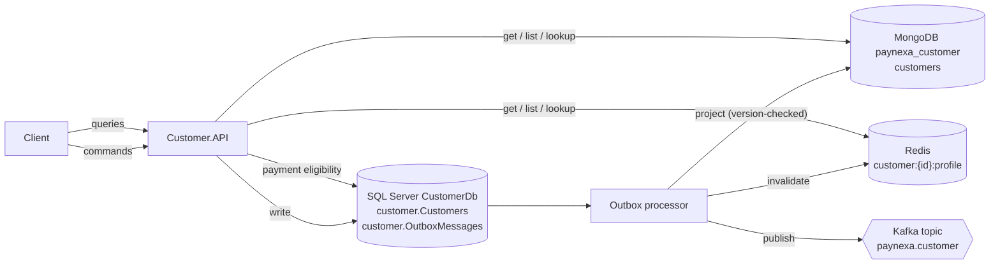

# Customer Service

**Status:** Implemented (v1)
**Service name:** `customer-service` · **Compose service:** `customer.api` · **Container:** `service-customer-api` · **Ports:** HTTPS `6001`, HTTP `5001` (local and Docker)
**Swagger (Development):** https://localhost:6001/swagger — opens automatically on F5 / `dotnet run`

Owns the customer (the person who pays): registration, identity verification (KYC), residential address, contact details, account lifecycle and payment eligibility. Payment Service asks this service whether a customer may pay.

---

## 1. Responsibilities

- Register adult customers (configurable minimum age) with a unique email address and optional residential address.
- Maintain profile, email and address.
- Run the KYC lifecycle: `Pending → Verified` (requires an address) or `Pending → Rejected → Verified`.
- Run the account lifecycle: `Active ⇄ Suspended`, `Active/Suspended → Closed` (terminal) with a mandatory reason.
- Decide **payment eligibility** (active + KYC verified) from the source of truth.
- Publish every change as an integration event to Kafka through the transactional outbox.

Out of scope: credentials (Authentication), document storage for KYC evidence, payments.

---

## 2. Architecture



| Layer | Contents |
|---|---|
| `Customer.Domain` | `CustomerAggregate/Customer.cs` (`AggregateRoot<CustomerId>`); value objects `CustomerId`, `PersonName`, `Email`, `PhoneNumber`, `Address`, `StatusReason`; enums `CustomerStatus`, `KycStatus`; `CustomerPolicy`; `PaymentEligibility`; nine domain events; `Common/Errors` |
| `Customer.Application` | 9 commands (shared `CustomerCommandHandler<T>` base), 4 queries, validators, `CustomerIntegrationEventHandler` (domain → integration events), Mapperly `CustomerMapper`, `CustomerOptions`, `AddApplication()` |
| `Customer.Infrastructure` | `CustomerDbContext` + configuration + migrations, repository, seeder; MongoDB read model, read store, indexes, projection, Mapperly `CustomerReadModelMapper`; Kafka publishing; `AddInfrastructure()` |
| `Customer.Contracts` | Request bodies, `CustomerResponse`, `PaymentEligibilityResponse`, `AddressDto`, integration events with `CustomerSnapshot` |
| `Customer.API` | `Controllers/V1/CustomersController` (partials: queries, `.Profile`, `.Status`, `.Kyc`), `Routing/CustomerRoutes`, `Requests/ListCustomersRequest` + `CustomerLookupRequest`, Mapperly `CustomerRequestMapper`, `DependencyInjection.cs`, `Program.cs` |

---

## 3. Data ownership

| Store | Role | Details |
|---|---|---|
| SQL Server `CustomerDb`, schema `customer` | **Write store and source of truth**; read store for payment eligibility | `Customers` (unique `Email`, index `CreatedAtUtc`, index `(Status, KycStatus)`, `Version` concurrency token, audit columns) and `OutboxMessages` |
| MongoDB `paynexa_customer` | **Read store** | `customers` projected from the outbox; indexes on `createdAtUtc`, `updatedAtUtc`, `lastName`, `firstName`, `email`, `(status, kycStatus)` |
| Redis | Cache in front of the read store | `customer:{customerId:N}:profile`, TTL `Customer:ProfileCacheTimeToLive`, invalidated by the projection |
| Kafka | Integration events | Topic `paynexa.customer`, key = customer id |

### Customer

| Field | Rules |
|---|---|
| `id` | `CustomerId` (UUID v7) |
| `firstName`, `lastName` | `PersonName` — required, trimmed, max 100 each |
| `email` | `Email` — valid, dotted domain, max 254, stored lower-case, unique |
| `phoneNumber` | `PhoneNumber` — E.164 |
| `dateOfBirth` | `1900-01-01` to today; at least `Customer:MinimumAgeYears` (default 18) years old |
| `address` | `Address` — line 1, optional line 2, city, optional state, postal code, ISO 3166-1 alpha-2 country (upper-cased) |
| `status` / `statusReason` | `Active`, `Suspended`, `Closed`; reason required for suspend/close (max 500) |
| `kycStatus` / `kycRejectionReason` | `Pending`, `Verified`, `Rejected` |
| `createdAtUtc`, `createdBy`, `updatedAtUtc`, `updatedBy` | Stamped automatically (`sub` claim, `anonymous`, or `system`) |
| `version` (internal) | 1 on create, +1 on every change — concurrency and projection ordering |

### Development seed data

Seeded on startup in Development when `customer.Customers` is empty (through the domain, so read models and Kafka are filled too):

| Id | Name | Email | KYC | Eligible |
|---|---|---|---|---|
| `58c49479-ec65-4de2-86e7-033c546291aa` | Saidul Islam Rajib | saidul.is.rajib@gmail.com | Verified | yes |
| `189dc8dc-990f-48e0-a37b-e6f2b60b9d7d` | Test Customer | test@gmail.com | Pending | no |

---

## 4. API

Base path `/api/v1/customers` (route and version come from the base controller and the `Controllers.V1` namespace). JSON is camelCase, query parameters kebab-case. Errors are Problem Details with `traceId`, `correlationId`, `errorCode`. Every command returns the updated `CustomerResponse`.

| Method | Route | Purpose | Success | Typical errors |
|---|---|---|---|---|
| POST | `/` | Register | 201 + `Location` | 400, 409 `EmailAlreadyRegistered`, 422 |
| GET | `/?page=&page-size=&search=&status=&kyc-status=&sort-by=&sort-order=` | List (read store) | 200 | 400 |
| GET | `/{id}` | Get (cache → read store) | 200 | 404 |
| GET | `/lookup?email=` | Find by email (read store) | 200 | 400, 404 |
| GET | `/{id}/payment-eligibility` | Can this customer pay? (write store) | 200 | 404 |
| PUT | `/{id}` | Update name and phone | 200 | 400, 404, 409 `Closed` / `ConcurrentModification` |
| PUT | `/{id}/email` | Change email | 200 | 400, 404, 409 `EmailAlreadyRegistered` |
| PUT | `/{id}/address` | Change residential address | 200 | 400, 404, 409 |
| POST | `/{id}/suspend` | Suspend (`{ "reason": "…" }`) | 200 | 400, 404, 409 `NotActive` / `Closed` |
| POST | `/{id}/reactivate` | Reactivate a suspended customer | 200 | 404, 409 `NotSuspended` |
| POST | `/{id}/close` | Close permanently (`{ "reason": "…" }`) | 200 | 400, 404, 409 `Closed` |
| POST | `/{id}/kyc/verify` | Mark identity verified | 200 | 404, 409 `KycAlreadyVerified`, 422 `AddressRequiredForKyc` |
| POST | `/{id}/kyc/reject` | Reject identity (`{ "reason": "…" }`) | 200 | 400, 404, 409 `KycNotPending` |

### Register

```json
{
  "firstName": "Nadia",
  "lastName": "Rahman",
  "email": "nadia@example.com",
  "phoneNumber": "+8801711000000",
  "dateOfBirth": "1992-03-10",
  "address": { "line1": "Gulshan Ave", "line2": null, "city": "Dhaka", "state": null, "postalCode": "1212", "countryCode": "bd" }
}
```

### Customer response

```json
{
  "id": "01a0d92c-1476-7bf2-a97e-c02723b33032",
  "firstName": "Nadia",
  "lastName": "Rahman",
  "email": "nadia@example.com",
  "phoneNumber": "+8801711000000",
  "dateOfBirth": "1992-03-10",
  "address": { "line1": "Gulshan Ave", "line2": null, "city": "Dhaka", "state": null, "postalCode": "1212", "countryCode": "BD" },
  "status": "Active",
  "statusReason": null,
  "kycStatus": "Pending",
  "kycRejectionReason": null,
  "createdAtUtc": "2026-09-25T15:25:39.992Z",
  "createdBy": "anonymous",
  "updatedAtUtc": "2026-09-25T15:25:39.992Z",
  "updatedBy": "anonymous"
}
```

### Payment eligibility

```json
{
  "customerId": "01a0d92c-1476-7bf2-a97e-c02723b33032",
  "isEligible": false,
  "reasons": [ { "code": "Customer.NotActive", "description": "Only an active customer can perform this operation." } ]
}
```

### List

Parameters: `page` (≥ 1, default 1), `page-size` (1–100, default 20), `search` (first/last name or email, max 100), `status` (`Active|Suspended|Closed`), `kyc-status` (`Pending|Verified|Rejected`), `sort-by` (`created-at|updated-at|first-name|last-name|email`, default `created-at`), `sort-order` (`asc|desc`, default `desc`). All values are case-insensitive; validation errors are keyed by the parameter name.

```json
{ "items": [ … ], "page": 1, "pageSize": 20, "totalCount": 2, "totalPages": 1, "hasPreviousPage": false, "hasNextPage": false }
```

---

## 5. Events

| Domain event | Integration event | `changeType` |
|---|---|---|
| `CustomerRegisteredDomainEvent` | `customer.created` v1 | — |
| `CustomerProfileUpdatedDomainEvent` | `customer.updated` v1 | `ProfileUpdated` |
| `CustomerEmailChangedDomainEvent` | `customer.updated` v1 | `EmailChanged` |
| `CustomerAddressChangedDomainEvent` | `customer.updated` v1 | `AddressChanged` |
| `CustomerSuspendedDomainEvent` | `customer.updated` v1 | `Suspended` |
| `CustomerReactivatedDomainEvent` | `customer.updated` v1 | `Reactivated` |
| `CustomerClosedDomainEvent` | `customer.updated` v1 | `Closed` |
| `CustomerKycVerifiedDomainEvent` | `customer.updated` v1 | `KycVerified` |
| `CustomerKycRejectedDomainEvent` | `customer.updated` v1 | `KycRejected` |

Payload: `eventId`, `occurredAtUtc`, (`changeType`,) and `customer` — a full `CustomerSnapshot` including `version`. Topic `paynexa.customer`, key = customer id, headers per [BuildingBlocks.md](BuildingBlocks.md#kafka-conventions). Consumers ignore snapshots whose `version` is not newer than theirs.

---

## 6. Logging

A suspension, filtered in Seq by `CorrelationId`:

```text
HTTP POST /api/v1/customers/{id}/suspend started
Command SuspendCustomerCommand started
SuspendCustomerCommand: Validation started / succeeded / ended
SQL Server SELECT on CustomerDb started / succeeded (LinqQuery)
SuspendCustomerCommand: Persist customer to write store started
SuspendCustomerCommand: Handle domain event CustomerSuspendedDomainEvent started / succeeded / ended
SQL Server UPDATE + INSERT (outbox) on CustomerDb succeeded (SaveChanges)
SuspendCustomerCommand: Persist customer to write store succeeded / ended
SuspendCustomerCommand applied to customer {id}; now at version 3
SuspendCustomerCommand succeeded / ended
HTTP POST /api/v1/customers/{id}/suspend responded 200
Outbox.CustomerUpdatedIntegrationEvent: Project customer to read store / Redis DEL / Kafka publish customer.updated to paynexa.customer … succeeded
```

Business event ids: `10001` registered, `10002` changed, `10003` seeded. Startup (migrations, indexes, topics, seeding) runs under its own correlation id.

---

## 7. Configuration

| Key | Development (`appsettings.Development.json`) | Docker (`docker-compose.override.yml`) |
|---|---|---|
| `ConnectionStrings:CustomerDb` | `Server=localhost,1433;Database=CustomerDb;User Id=sa;…` | `Server=sqlserver;Database=CustomerDb;User Id=sa;…` |
| `SqlServer:Password` | user-secrets (`paynexa-customer-api`) | `SQL_SA_PASSWORD` from `src/.env` |
| `MongoDb:ConnectionString` / `DatabaseName` | `mongodb://localhost:27017` / `paynexa_customer` | `mongodb://mongodb:27017` |
| `Redis:ConnectionString` | `localhost:6379` | `redis:6379` |
| `Kafka:BootstrapServers` | `localhost:9092` | `kafka:29092` |
| `Customer:MinimumAgeYears` | 18 | 18 |
| `Customer:ProfileCacheTimeToLive` | `00:10:00` | `00:10:00` |
| `PayNexaLogging:SeqServerUrl` | `http://localhost:5341` | `http://seq:5341` |

Shared keys: [BuildingBlocks.md](BuildingBlocks.md#13-configuration-reference).

---

## 8. Running and testing

- **Visual Studio:** start `docker-compose` (Swagger opens at https://localhost:6001/swagger), or start `Customer.API` with the `https` profile while the infrastructure containers run.
- **Command line:** `docker compose up -d --build` from the repository root; rebuild only this service with `docker compose up -d --build customer.api`.
- **Sample requests:** `src/Services/Customer/Customer.API/Customer.API.http`.
- **Unit tests** (`tests/Unit/Customer.UnitTests`, 69 tests): value objects, aggregate lifecycle (status transitions, KYC, minimum age, eligibility), validators (including query-parameter error keys), register handler, shared command handler (not found, concurrency, domain rules, email uniqueness), integration-event mapping, Mapperly mappers, queries (cache, email lookup, eligibility from the write store, filters).

```powershell
dotnet test --solution src/PayNexa.slnx
```
