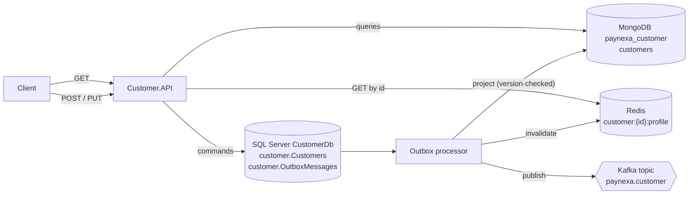

# Customer Service

**Status:** Implemented (v1)
**Service name:** `customer-service` · **Container:** `customer.api` · **Ports:** HTTPS `6001`, HTTP `5001` (local and Docker)
**Swagger (Development):** https://localhost:6001/swagger — opens automatically on F5 / `dotnet run`

Owns customer profiles: registration, profile updates and customer lookup. Payment Service will call it synchronously (REST) to validate a customer before accepting a payment.

---

## 1. Responsibilities

- Register customers with a unique email address.
- Update profile details (first name, last name, phone number). Email and date of birth are immutable after registration.
- Serve customer lookups and paged, searchable, sortable customer lists.
- Publish `customer.created` and `customer.updated` integration events to Kafka through the transactional outbox.

Out of scope: authentication and credentials (Authentication Service), KYC documents, payments.

---

## 2. Architecture



| Layer | Contents |
|---|---|
| `Customer.Domain` | `CustomerAggregate/Customer.cs` (`AggregateRoot<CustomerId>`), value objects `CustomerId`, `PersonName`, `Email`, `PhoneNumber`, enum `CustomerStatus`, domain events `CustomerRegisteredDomainEvent` and `CustomerProfileUpdatedDomainEvent`; `Common/Errors` (`Errors.Customer`, `CustomerErrorCodes`, `CustomerErrorMessages`) |
| `Customer.Application` | Commands `CreateCustomer`, `UpdateCustomer`; queries `GetCustomerById`, `ListCustomers`; validators; domain-event handlers that enqueue integration events; `ICustomerRepository`, `ICustomerReadStore`; cache keys; `AddApplication()` |
| `Customer.Infrastructure` | `CustomerDbContext` + EF configuration + migrations, `CustomerRepository`, `CustomerDataSeeder`; MongoDB read model, read store, indexes and projection; Kafka publishing; `AddInfrastructure()` |
| `Customer.Contracts` | `CreateCustomerRequest`, `UpdateCustomerRequest`, `CustomerResponse`, `CustomerCreatedIntegrationEvent`, `CustomerUpdatedIntegrationEvent` |
| `Customer.API` | `CustomersController`, `DependencyInjection.cs` (`AddPresentation` / `UsePresentation`), `Program.cs` |

---

## 3. Data ownership

| Store | Role | Details |
|---|---|---|
| SQL Server `CustomerDb`, schema `customer` | **Write store, source of truth** | `Customers` (unique index on `Email`, index on `CreatedAtUtc`, `Version` concurrency token) and `OutboxMessages` |
| MongoDB `paynexa_customer` | **Read store** | `customers` collection projected from the outbox; indexes on `createdAtUtc`, `lastName`, `firstName`, `email` |
| Redis | Cache in front of the read store | `customer:{customerId:N}:profile`, TTL 10 minutes, invalidated by the projection after every change |
| Kafka | Integration events | Topic `paynexa.customer`, key = customer id |

- Writes go to SQL Server only; a command's response is built from the write model.
- Reads are eventually consistent (about one outbox polling interval, 1 s).
- The service holds no monetary data.

### Customer

| Field | Rules |
|---|---|
| `id` | `CustomerId` (UUID v7) |
| `firstName`, `lastName` | `PersonName` value object — required, trimmed, max 100 characters each |
| `email` | `Email` value object — valid address with a dotted domain, max 254, stored lower-case, unique |
| `phoneNumber` | `PhoneNumber` value object — E.164, e.g. `+8801700000000` |
| `dateOfBirth` | `1900-01-01` to today |
| `status` | `Active` (new customers), `Suspended`, `Closed` — closed customers cannot be updated |
| `createdAtUtc`, `updatedAtUtc` | UTC |
| `version` (internal) | Starts at 1, incremented on every change |

### Development seed data

On startup in Development, when `customer.Customers` is empty, two customers are registered through the domain model (so their events also fill MongoDB and Kafka):

| Id | Name | Email |
|---|---|---|
| `58c49479-ec65-4de2-86e7-033c546291aa` | Saidul Islam Rajib | saidul.is.rajib@gmail.com |
| `189dc8dc-990f-48e0-a37b-e6f2b60b9d7d` | Test Customer | test@gmail.com |

---

## 4. API

Base path: `/api/v1/customers`. JSON properties are camelCase; query parameters are kebab-case (requirements §27). All errors use Problem Details with `traceId`, `correlationId` and `errorCode`. Send `X-Correlation-Id` to trace a request end to end.

### 4.1 Create customer

```http
POST /api/v1/customers
Content-Type: application/json
```

```json
{
  "firstName": "Saidul Islam",
  "lastName": "Rajib",
  "email": "saidul.is.rajib@gmail.com",
  "phoneNumber": "+8801700000000",
  "dateOfBirth": "1995-05-20"
}
```

**201 Created** with `Location: /api/v1/customers/{id}`:

```json
{
  "id": "01a0d775-8b75-72de-bcab-3c690216124b",
  "firstName": "Saidul Islam",
  "lastName": "Rajib",
  "email": "saidul.is.rajib@gmail.com",
  "phoneNumber": "+8801700000000",
  "dateOfBirth": "1995-05-20",
  "status": "Active",
  "createdAtUtc": "2026-09-25T07:26:39.989Z",
  "updatedAtUtc": "2026-09-25T07:26:39.989Z"
}
```

| Status | `errorCode` | When |
|---|---|---|
| 400 | `Validation.Failed` | Invalid fields (see `errors`) |
| 409 | `Customer.EmailAlreadyRegistered` | Email already registered (also when a concurrent request wins the unique index) |
| 422 | `Customer.Invalid*` | A domain rule rejected the input |

### 4.2 Get customer by id

```http
GET /api/v1/customers/{id}
```

**200 OK** — same body as above (Redis, then MongoDB).

| Status | `errorCode` | When |
|---|---|---|
| 404 | `Customer.NotFound` | Unknown id (or not yet projected, ~1 s after creation) |

### 4.3 List customers

```http
GET /api/v1/customers?page=1&page-size=20&search=rajib&sort-by=created-at&sort-order=desc
```

| Parameter | Default | Rules |
|---|---|---|
| `page` | `1` | ≥ 1 |
| `page-size` | `20` | 1–100 |
| `search` | — | Case-insensitive match on first name, last name or email; max 100 characters |
| `sort-by` | `created-at` | `created-at`, `first-name`, `last-name`, `email` (case-insensitive) |
| `sort-order` | `desc` | `asc`, `desc` |

**200 OK**

```json
{
  "items": [ { "id": "58c49479-ec65-4de2-86e7-033c546291aa", "firstName": "Saidul Islam", "…": "…" } ],
  "page": 1,
  "pageSize": 20,
  "totalCount": 2,
  "totalPages": 1,
  "hasPreviousPage": false,
  "hasNextPage": false
}
```

| Status | `errorCode` | When |
|---|---|---|
| 400 | `Validation.Failed` | Invalid paging or sorting; errors are keyed by the query parameter (`page-size`, `sort-by`, …) |

### 4.4 Update customer

```http
PUT /api/v1/customers/{id}
Content-Type: application/json
```

```json
{
  "firstName": "Saidul Islam",
  "lastName": "Rajib",
  "phoneNumber": "+8801700000001"
}
```

**200 OK** — the updated customer.

| Status | `errorCode` | When |
|---|---|---|
| 400 | `Validation.Failed` | Invalid fields |
| 404 | `Customer.NotFound` | Unknown id |
| 409 | `Customer.ConcurrentModification` | Changed by another request in the meantime; reload and retry |
| 422 | `Customer.Closed` | The customer is closed |

### 4.5 Operational endpoints

| Endpoint | Purpose |
|---|---|
| `/health`, `/health/live`, `/health/ready` | Health (ready = SQL Server + MongoDB + Redis + Kafka) |
| `/openapi/v1.json`, `/swagger` | OpenAPI document and Swagger UI (Development only) |

---

## 5. Events

| Domain event | Raised by | Integration event | Kafka |
|---|---|---|---|
| `CustomerRegisteredDomainEvent` | `Customer.Register` | `CustomerCreatedIntegrationEvent` (`customer.created`, v1) | `paynexa.customer`, key = customer id |
| `CustomerProfileUpdatedDomainEvent` | `Customer.UpdateProfile` | `CustomerUpdatedIntegrationEvent` (`customer.updated`, v1) | `paynexa.customer`, key = customer id |

The integration event carries the full customer snapshot plus `eventId`, `occurredAtUtc` and `version`. Consumers must ignore events whose `version` is not newer than what they already hold. Headers: see [BuildingBlocks.md](BuildingBlocks.md#kafka-conventions).

---

## 6. Logging

A successful update, filtered in Seq by `CorrelationId`:

```text
HTTP PUT /api/v1/customers/58c49479-… started
Command UpdateCustomerCommand started
UpdateCustomerCommand: Validation started / succeeded / ended
SQL Server SELECT on CustomerDb started / succeeded (LinqQuery)
UpdateCustomerCommand: Persist customer to write store started
UpdateCustomerCommand: Handle domain event CustomerProfileUpdatedDomainEvent started / succeeded / ended
SQL Server UPDATE on CustomerDb started / succeeded (SaveChanges)
UpdateCustomerCommand: Persist customer to write store succeeded / ended
Customer 58c49479-… profile updated to version 2
UpdateCustomerCommand succeeded / ended
HTTP PUT /api/v1/customers/58c49479-… responded 200
Outbox.CustomerUpdatedIntegrationEvent: Dispatch CustomerUpdatedIntegrationEvent started
Outbox.CustomerUpdatedIntegrationEvent: Project customer to read store started / succeeded / ended
Outbox.CustomerUpdatedIntegrationEvent: Redis DEL started / succeeded / ended
Outbox.CustomerUpdatedIntegrationEvent: Kafka publish customer.updated to paynexa.customer started / succeeded (Partition, Offset) / ended
Outbox.CustomerUpdatedIntegrationEvent: Dispatch CustomerUpdatedIntegrationEvent succeeded / ended
```

Business events: `10001` registered, `10002` profile updated, `10003` seeded. Email and phone number are masked in every log event.

---

## 7. Configuration

| Key | Docker value |
|---|---|
| `Service:Name` | `customer-service` |
| `ConnectionStrings:CustomerDb` | from `src/.env` (`SQL_SA_PASSWORD`) — never in appsettings |
| `MongoDb:ConnectionString` / `DatabaseName` | `mongodb://mongodb:27017` / `paynexa_customer` |
| `Redis:ConnectionString` | `redis:6379` |
| `Kafka:BootstrapServers` | `kafka:29092` (`localhost:9092` when running on the host) |
| `PayNexaLogging:SeqServerUrl` | `http://seq:5341` |
| `Observability:OtlpTracesEndpoint` | `http://seq:5341/ingest/otlp/v1/traces` |

Shared keys: [BuildingBlocks.md](BuildingBlocks.md#12-configuration-reference).

---

## 8. Running and testing

**Visual Studio:** set `docker-compose` as the startup project and press F5 — Swagger opens at https://localhost:6001/swagger. Or set `Customer.API` (profile `https`) as the startup project with the infrastructure containers running.

**Command line:**

```powershell
cd src
docker compose up -d --build
start https://localhost:6001/swagger
```

On first start in Development the service creates `CustomerDb` (migrations), the MongoDB collection and indexes, the Kafka topic `paynexa.customer`, and seeds the two customers above.

Sample requests: `src/Services/Customer/Customer.API/Customer.API.http`.

**Unit tests** (`tests/Unit/Customer.UnitTests`): value objects, aggregate behavior and domain events, validators (including query-parameter error keys), command handlers, domain-event handlers (integration event mapping and topic metadata), query handlers (cache, sorting, paging).

```powershell
dotnet test --solution src/PayNexa.slnx
```
