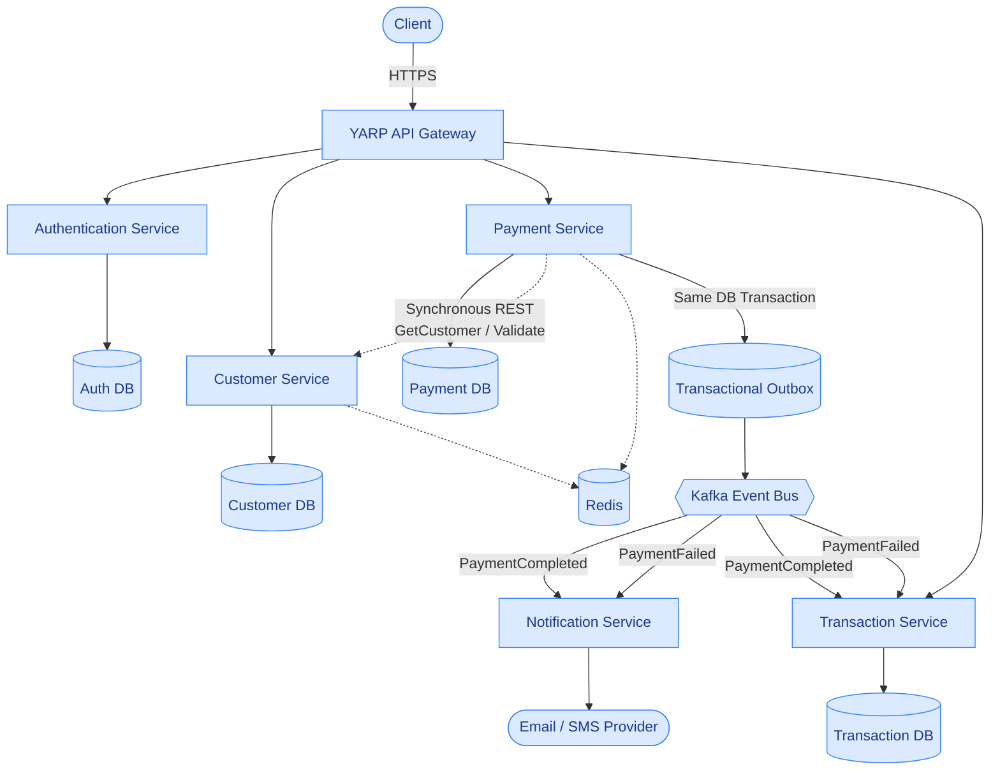
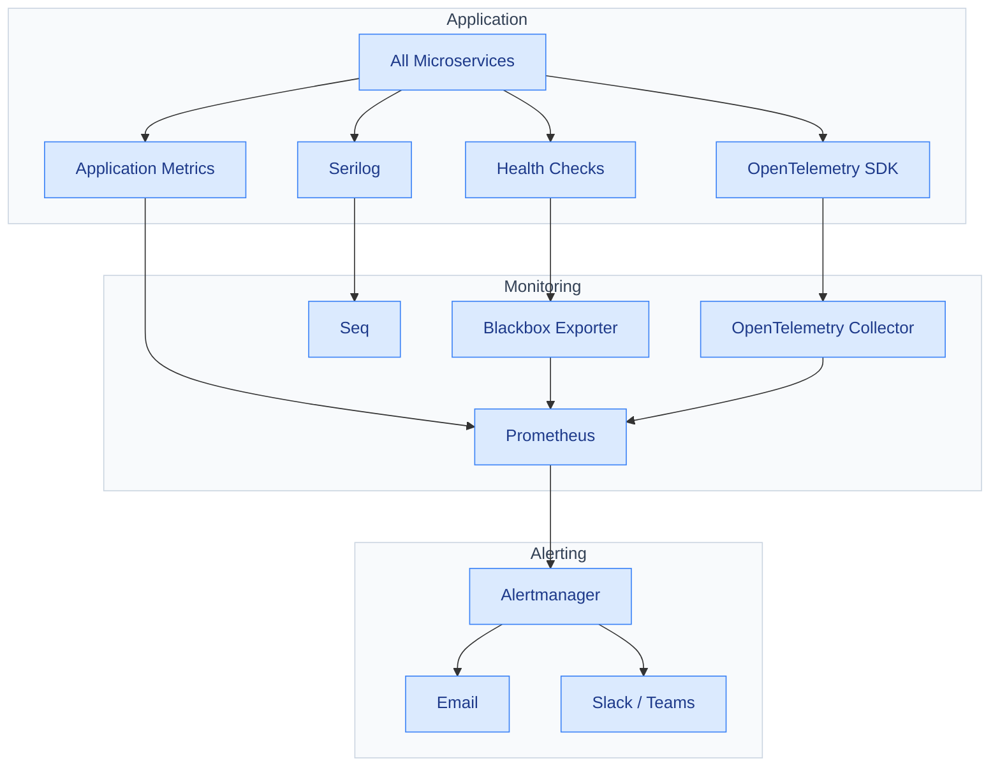

# Fintech Microservices Platform — Industry-Grade Requirements
# Recommended project name: PayNexa
## 1. Purpose

Build a production-oriented fintech microservices reference platform using **ASP.NET Core** and modern distributed-system practices.

The primary goals are to demonstrate:

- Microservices architecture
- Clean Architecture
- CQRS
- Domain-driven design principles where appropriate
- Secure secret management with HashiCorp Vault
- Structured centralized logging with Serilog + Seq
- Distributed tracing and correlation
- Event-driven architecture with Apache Kafka
- API Gateway with YARP
- Shared MongoDB
- Shared Redis cache
- SQL Server for services that require relational/transactional persistence
- Health checks, monitoring, alerting, and resilience
- Authentication, authorization, auditability, and fintech-grade idempotency
- Automated testing and CI/CD

The project should be designed as a **realistic production-style system**, not as a collection of CRUD APIs.

---

# 2. Core Architectural Principles

The platform MUST follow these principles:

- Each microservice owns its business logic and application boundary.
- Services should be independently deployable.
- Avoid shared business/domain code between services.
- Database access must remain behind the appropriate service boundary.
- Synchronous communication should be used only where an immediate response is required, and is implemented as REST over HTTP(S) — no gRPC or GraphQL in this platform.
- Kafka should be preferred for asynchronous, event-driven workflows.
- Financial operations must be idempotent.
- Secrets must never be committed to source control.
- Sensitive information must never be written to logs.
- All important operations must be observable.
- Every distributed request must be traceable across services.
- Failures must be explicit, detectable, and recoverable where appropriate.
- Configuration must be environment-aware.
- Security must be considered from the beginning rather than added later.

---

# 3. Target Microservices

The initial platform should contain:

1. API Gateway
2. Authentication Service
3. Customer Service
4. Payment Service
5. Transaction Service
6. Notification Service

Additional services may be introduced later if a clear business boundary requires them.

## 3.1 Solution / Folder Structure

The codebase is organized as a single `src` root containing one folder per deployable — the same pattern as a typical multi-service `.sln` layout: one `src`, many services, each service a peer of the others and never nested inside another service.

Each business service internally follows Clean Architecture (Section 4) as separate projects, so a change to Infrastructure never forces a rebuild of Domain, and the `.API` project stays a thin composition layer over Application.

```text
PayNexa/
├── src/
│   ├── ApiGateway/
│   │   └── PayNexa.ApiGateway/                  (YARP)
│   │
│   ├── Services/
│   │   ├── Authentication/
│   │   │   ├── Authentication.API/
│   │   │   ├── Authentication.Application/
│   │   │   ├── Authentication.Domain/
│   │   │   ├── Authentication.Infrastructure/
│   │   │   └── Authentication.Contracts/
│   │   │
│   │   ├── Customer/
│   │   │   ├── Customer.API/
│   │   │   ├── Customer.Application/
│   │   │   ├── Customer.Domain/
│   │   │   ├── Customer.Infrastructure/
│   │   │   └── Customer.Contracts/
│   │   │
│   │   ├── Payment/
│   │   │   ├── Payment.API/
│   │   │   ├── Payment.Application/
│   │   │   ├── Payment.Domain/
│   │   │   ├── Payment.Infrastructure/
│   │   │   └── Payment.Contracts/
│   │   │
│   │   ├── Transaction/
│   │   │   ├── Transaction.API/
│   │   │   ├── Transaction.Application/
│   │   │   ├── Transaction.Domain/
│   │   │   ├── Transaction.Infrastructure/
│   │   │   └── Transaction.Contracts/
│   │   │
│   │   └── Notification/
│   │       ├── Notification.API/
│   │       ├── Notification.Application/
│   │       ├── Notification.Domain/
│   │       ├── Notification.Infrastructure/
│   │       └── Notification.Contracts/
│   │
│   └── BuildingBlocks/
│       ├── PayNexa.Common/                      (Result/Error types, pipeline behaviors, abstractions)
│       ├── PayNexa.AspNetCore/                  (service defaults, ProblemDetails, exception handler, versioning)
│       ├── PayNexa.Logging/                     (Serilog bootstrap, enrichers, masking, correlation)
│       ├── PayNexa.Observability/                (OpenTelemetry setup, health checks, service-to-service clients)
│       ├── PayNexa.SqlServer/                   (write store: EF Core, unit of work, transactional outbox)
│       ├── PayNexa.MongoDb/                     (read store: read models, projections, indexes)
│       ├── PayNexa.Caching/                     (Redis cache-aside)
│       ├── PayNexa.Messaging/                   (Kafka producer/consumer)
│       └── PayNexa.Vault/                       (VaultSharp client wrapper, secret providers)
│
├── tests/
├── infrastructure/
├── docs/
├── docker-compose.yml
└── PayNexa.sln
```

`Contracts` holds only what a service exposes to the outside world (HTTP request/response DTOs, Kafka event payloads) — never shared domain entities. Services may reference another service's `Contracts` project; they must never reference another service's `Domain`, `Application`, or `Infrastructure` project.

## 3.2 High-Level Runtime Architecture



Notification Service has no public Gateway route — it is reachable only through Kafka. Solid lines are the primary request/persistence/event path; dashed lines are the synchronous cross-service REST call and Redis cache-aside reads. Transactional Outbox is drawn as its own node to highlight the outbox pattern (Section 15), but it is a table inside Payment DB, written in the same transaction as the payment — not a separate physical store. MongoDB, Vault, and the observability pipeline are omitted here to keep the primary flow readable; they're covered in Data & Caching Details and Cross-Cutting Details below.

### Data & Caching Details

Every service follows the Write/Read Store rule (Section 5.1): commands write to
SQL Server, queries read from MongoDB read models, and money is always read from SQL Server.

```text
SQL Server — WRITE store and source of truth (one instance, one database per service,
never a shared schema). Each database also holds that service's outbox table:
  Authentication Service  ──► AuthDb          (users, credentials, refresh tokens)
  Customer Service        ──► CustomerDb      (customer profiles)
  Payment Service         ──► PaymentDb       (payments, amounts — also the READ store for money)
  Transaction Service     ──► TransactionDb   (transactions, amounts — also the READ store for money)
  Notification Service    ──► NotificationDb  (notification requests and delivery state)

MongoDB — READ store (shared cluster, one database per service — shared
infrastructure, never shared ownership, Section 6). Read models are projections
of the SQL Server state, updated from the outbox:
  Authentication Service  ──► paynexa_auth          (user profile read model)
  Customer Service        ──► paynexa_customer      (customer read model)
  Payment Service         ──► paynexa_payment       (non-financial payment metadata)
  Transaction Service     ──► paynexa_transaction   (non-financial history views)
  Notification Service    ──► paynexa_notification  (notification history read model)
  Any service             ──► AuditEvents           (audit trail, Section 31)

Redis (shared cache, namespaced keys per service, cache-aside pattern, Section 9):
  customer:{customerId}:profile     ── Customer Service read-through cache
  payment:{paymentId}:status        ── Payment Service status lookup cache
  idempotency:{service}:{key}       ── idempotency records (Section 16)
  ratelimit:{service}:{clientId}    ── Gateway/service rate limiting

  Redis is never the source of truth for financial state.
```

### Cross-Cutting Details

```text
Every service (Authentication, Customer, Payment, Transaction, Notification)
  │
  ├── secrets in  ──► HashiCorp Vault
  │                     KV v2 (static) · Database engine (dynamic creds)
  │                     Transit (encryption-as-a-service) · JWT signing keys
  │
  └── telemetry out ──► Serilog ──► Seq
                        OpenTelemetry SDK ──► OTel Collector
                                                 ├── Traces  → Jaeger / Tempo
                                                 └── Metrics → Prometheus → Grafana
```

## 3.3 .NET Solution Conventions

- **Central Package Management**: pin every NuGet package version once in a root `Directory.Packages.props` (`<ManagePackageVersionsCentrally>true</ManagePackageVersionsCentrally>`). Individual `.csproj` files reference packages by name only (`<PackageReference Include="Serilog" />`), with no version attribute. A version bump becomes a single-file change instead of hunting across every service's `.csproj`, and guarantees every service builds against the same package version.
- **Global usings**: enable `<ImplicitUsings>enable</ImplicitUsings>` and centralize the common, solution-wide `using` directives (e.g. `System`, `System.Linq`, `MediatR`) in a `GlobalUsings.cs` per project rather than repeating the same boilerplate block at the top of every file. Keep usings that are specific to one file local to that file — global usings are for what's genuinely used everywhere.
- **`Directory.Build.props`**: define solution-wide MSBuild settings shared by every project — target framework, nullable reference types, warnings-as-errors, shared analyzers — once at the root, so each `.csproj` only declares what's actually specific to it.

---

# 4. Clean Architecture

Each business service MUST follow Clean Architecture.

Recommended structure:

```text
Service
├── Domain
│   ├── Entities
│   ├── ValueObjects
│   ├── Enums
│   ├── DomainEvents
│   ├── DomainExceptions
│   └── Interfaces
│
├── Application
│   ├── Commands
│   ├── Queries
│   ├── Handlers
│   ├── DTOs
│   ├── Validators
│   ├── Behaviors
│   ├── Interfaces
│   └── Mappings
│
├── Infrastructure
│   ├── Persistence
│   ├── Repositories
│   ├── Kafka
│   ├── Redis
│   ├── MongoDB
│   ├── Vault
│   ├── ExternalServices
│   └── Observability
│
└── API
    ├── Controllers
    ├── Middleware
    ├── Filters
    ├── HealthChecks
    ├── Authentication
    └── DependencyInjection
```

Dependency direction:

```text
API
 ↓
Application
 ↓
Domain

Infrastructure → Application/Domain
```

The Domain layer must not depend on Infrastructure.

---

# 5. CQRS — Mandatory

The project MUST consistently follow **CQRS (Command Query Responsibility Segregation)**.

Commands and Queries must be separated.

## Commands

Commands change state.

Examples:

```text
CreateCustomerCommand
UpdateCustomerCommand
CreatePaymentCommand
ProcessPaymentCommand
CancelPaymentCommand
CreateTransactionCommand
SendNotificationCommand
```

Command handlers are responsible for business operations and state changes.

## Queries

Queries only read data.

Examples:

```text
GetCustomerByIdQuery
GetCustomerTransactionsQuery
GetPaymentByIdQuery
GetTransactionByIdQuery
GetPaymentHistoryQuery
```

Queries must not modify state.

## Recommended Application Structure

```text
Application
├── Commands
│   ├── CreatePayment
│   │   ├── CreatePaymentCommand.cs
│   │   ├── CreatePaymentCommandHandler.cs
│   │   └── CreatePaymentCommandValidator.cs
│   │
│   └── CancelPayment
│       ├── CancelPaymentCommand.cs
│       └── CancelPaymentCommandHandler.cs
│
├── Queries
│   ├── GetPayment
│   │   ├── GetPaymentQuery.cs
│   │   └── GetPaymentQueryHandler.cs
│   │
│   └── GetTransactions
│       ├── GetTransactionsQuery.cs
│       └── GetTransactionsQueryHandler.cs
```

## 5.1 Write and Read Stores — Mandatory

CQRS is applied at the storage level as well as in code:

| Operation | Store | Rule |
|---|---|---|
| Commands (POST / PUT / PATCH / DELETE) | **SQL Server** | The only place data is created or changed. SQL Server is the **source of truth** for every service. |
| Queries (GET) | **MongoDB** | Served from read models (projections) of the SQL Server state. |
| Anything involving **payments, amounts, balances or other monetary values** | **SQL Server** | Money is written **and read** from the same source of truth. Financial queries and every decision that depends on a monetary value read from SQL Server — never from a MongoDB projection or a cache. |

Keeping the read store in sync:

```text
Command handler
   │  one SQL Server transaction
   ├──► business tables          (source of truth)
   └──► outbox table             (change event, same transaction — Section 15)
                 │
                 ▼
Outbox processor (background, retried, idempotent)
   ├──► MongoDB read model       (upsert, applied only if the version is newer)
   └──► Kafka                    (integration events, when the service publishes them)
```

- A command never writes to MongoDB directly, so SQL Server and MongoDB can never disagree permanently: a failed projection is retried from the outbox.
- Read models are **eventually consistent**. A command response is built from the write model, so the caller always sees its own change immediately.
- Projections are idempotent and version-checked, so replaying the outbox is always safe.
- A read model can be rebuilt from SQL Server at any time.
- Redis caches sit in front of the MongoDB read models only; money is never cached (Section 9).

Use MediatR or an equivalent mediator implementation where appropriate.

Use pipeline behaviors for cross-cutting concerns such as:

- Logging
- Validation
- Performance measurement
- Transaction boundaries where appropriate
- Authorization
- Idempotency
- Exception handling

---

# 6. Database Architecture

The platform will intentionally use:

- SQL Server
- MongoDB
- Redis

## Important Database Rule

MongoDB and Redis are **shared infrastructure**, but services must NOT share business ownership of the same data.

A shared database server/cluster does not mean shared domain ownership.

Each service should have logical isolation through:

- Separate databases
- Separate schemas
- Separate collections
- Separate Redis key namespaces
- Least-privilege credentials

where appropriate.

---

# 7. SQL Server

SQL Server is the write store and source of truth for every service that accepts writes (Section 5.1):

- Authentication Service
- Customer Service
- Payment Service
- Transaction Service
- Notification Service

It is also the read store for all payment, amount and balance data.

Use:

- EF Core
- Migrations
- Proper indexes
- Foreign keys where appropriate
- Optimistic concurrency
- Transactions
- Constraints
- Connection resiliency
- Query optimization

Financially important state changes must use proper transactional boundaries.

---

# 8. MongoDB

MongoDB is the read store of every service (Section 5.1). Queries are served from MongoDB read models that are projected from SQL Server through the outbox; commands never write to MongoDB directly.

MongoDB never serves payment, amount or balance data for decisions or financial queries — those are read from SQL Server.

Use cases:

- Read models for queries
- Audit records
- Notification history views
- Non-financial payment metadata
- Integration records

MongoDB usage must have a clear reason; it should not be introduced simply to demonstrate NoSQL.

All MongoDB operations must be observable.

Example log:

```text
MongoRepository.Insert started
Operation: InsertOne
Collection: PaymentMetadata
CorrelationId: ...
TraceId: ...
MongoRepository.Insert succeeded
DurationMs: 18
MongoRepository.Insert ended
```

---

# 9. Redis

Redis is a common shared caching infrastructure.

Use Redis for:

- Frequently accessed reference data
- Customer/profile caching where appropriate
- Payment/status lookup caching where safe
- Distributed locks only when truly required
- Rate limiting
- Idempotency records where appropriate
- Short-lived distributed state

Redis MUST NOT become the source of truth for financial transactions, and monetary values (payments, amounts, balances) are never served from the cache — they are always read from SQL Server (Section 5.1).

Use:

- TTL
- Cache-aside pattern
- Explicit invalidation
- Namespaced keys
- Serialization/versioning
- Appropriate eviction strategy

Example key:

```text
customer:{customerId}:profile
payment:{paymentId}:status
idempotency:{service}:{key}
```

Cache failures should be handled according to business requirements and should not silently corrupt financial state.

---

# 10. Data Ownership

Each service owns its data.

Example:

```text
Customer Service
    └── Customer data

Payment Service
    └── Payment data

Transaction Service
    └── Transaction data

Notification Service
    └── Notification data
```

Another service must not directly query another service's database.

Communication must happen through:

- REST APIs
- Kafka events

depending on the use case.

---

# 11. API Gateway — YARP

YARP will be the platform's API Gateway.

Responsibilities:

- Routing
- Authentication/authorization integration
- Correlation ID propagation
- Request logging
- Rate limiting
- Request policies
- API version routing
- Gateway-level error handling
- Health-aware routing where appropriate

Example:

```text
/api/v1/auth/*
        → Auth Service

/api/v1/customers/*
        → Customer Service

/api/v1/payments/*
        → Payment Service

/api/v1/transactions/*
        → Transaction Service
```

The Gateway must not contain business logic.

---

# 12. Authentication & Authorization

Authentication Service should handle:

- Registration
- Login
- Password hashing
- JWT access tokens
- Refresh tokens
- Token revocation
- Roles
- Permissions
- Security events

Use:

- JWT
- Role-based authorization
- Policy-based authorization
- Claims where appropriate

JWT signing keys MUST be stored in HashiCorp Vault.

Never store signing keys in:

```text
appsettings.json
appsettings.Production.json
Git
Docker image
```

---

# 13. HashiCorp Vault — Core Security Component

HashiCorp Vault is a primary feature of the project.

All sensitive secrets must be managed through Vault.

Potential secrets:

```text
SQL Server credentials
MongoDB credentials
Redis credentials
Kafka credentials
JWT signing keys
JWT encryption keys
Email credentials
Payment provider API keys
OAuth client secrets
External API credentials
```

Application configuration should contain non-sensitive configuration only.

Example:

```text
Application
    │
    ├── Non-sensitive configuration
    │
    └── Vault
          │
          ├── Database secrets
          ├── JWT secrets
          ├── Kafka secrets
          └── External API secrets
```

Where appropriate, demonstrate:

- AppRole/authentication
- Least-privilege Vault policies
- Secret rotation
- Secret versioning
- Dynamic credentials where practical
- Secret access auditing

The project should clearly demonstrate that applications do not need secrets hardcoded into source control.

## Vault — .NET Implementation Notes

- Use **VaultSharp** (or an equivalent actively-maintained .NET client) to authenticate and read secrets; avoid hand-rolled HTTP calls to the Vault API.
- Prefer **AppRole authentication** for services (Role ID baked into the image/deployment, Secret ID injected at deploy time) over root or static tokens.
- Choose the secrets engine based on the data:
  - **KV v2** for static configuration secrets (API keys, OAuth client secrets) — versioned, supports rollback.
  - **Database secrets engine** for SQL Server/MongoDB — Vault issues short-lived, auto-expiring credentials per service instance instead of a shared static connection string.
  - **Transit engine** ("encryption as a service") for encrypting sensitive fields (e.g. payment metadata, PII) at the application layer without services ever storing or handling raw encryption keys.
- Run a **Vault Agent** (sidecar/init container) with auto-auth and template rendering so secrets are delivered to the application as files or environment variables at container start, keeping Vault client complexity out of application code where practical.
- Dynamic credentials and tokens have leases; a background renewal process must renew them before expiry rather than assuming they live forever.
- Local development should run Vault in **dev mode** (in-memory, auto-unsealed) via Docker Compose; production must use a durable storage backend with a real unseal/auto-unseal strategy (e.g. cloud KMS auto-unseal). Dev mode must never be used in production.

---

# 14. Kafka Event-Driven Architecture

Apache Kafka will be used for asynchronous communication.

Example events:

```text
CustomerCreated
CustomerUpdated
PaymentInitiated
PaymentCompleted
PaymentFailed
TransactionCreated
TransactionCompleted
NotificationRequested
```

Example:

```text
Payment Service
      │
      │ PaymentCompleted
      ▼
    Kafka
      │
      ├──────────────→ Transaction Service
      │
      └──────────────→ Notification Service
```

Events should contain appropriate metadata:

```text
EventId
EventType
EventVersion
CorrelationId
TraceId
SourceService
OccurredAt
Payload
```

Implement:

- Producer/consumer logging
- Consumer groups
- Retry handling
- Dead-letter topics
- Idempotent consumers
- Event versioning
- Schema compatibility
- Poison-message handling
- Consumer lag monitoring

---

# 15. Transactional Messaging / Outbox Pattern

For operations where a database state change and Kafka event must remain consistent, implement the **Transactional Outbox Pattern**.

Example:

```text
Payment Service

BEGIN TRANSACTION
    Save Payment
    Save Outbox Event
COMMIT

        ↓

Outbox Publisher
        ↓
      Kafka
```

This prevents the classic failure:

```text
Database commit succeeded
Kafka publish failed
```

The outbox publisher should:

- Retry failed publishing
- Mark published events
- Avoid duplicate effects
- Log publishing status
- Preserve event metadata

This is especially important for payment/transaction workflows.

---

# 16. Idempotency

Financial operations MUST support idempotency.

Example:

```http
POST /api/v1/payments
Idempotency-Key: 8f3c-payment-123
```

If the same request arrives multiple times:

```text
First request
    → Payment created

Duplicate request
    → Existing result returned
```

The system must not create duplicate financial operations.

Idempotency records may use Redis or persistent storage depending on the operation's durability requirements.

---

# 17. Logging — Primary Project Focus

Logging is one of the most important requirements.

Use:

- Serilog
- Seq
- Structured logging
- Correlation IDs
- Trace IDs
- Request IDs
- Event IDs
- User/actor IDs where appropriate
- Service name
- Environment
- Machine/container information
- Duration
- Status
- Exception details

Logs must be searchable and machine-readable.

## Logging Implementation Notes

- Serilog sinks: Console (for container log collection) + Seq, wrapped in `Serilog.Sinks.Async` so logging never blocks request-handling or message-processing threads.
- Add a rolling-file sink (or equivalent durable local buffer) as a fallback so log events are not silently lost if Seq is temporarily unavailable.
- Use enrichers (`Serilog.Enrichers.Environment`, `Serilog.Enrichers.Process`, `Serilog.Enrichers.Span`) so every log event automatically carries machine/process info and the active OpenTelemetry TraceId/SpanId, instead of attaching them manually per call site.
- Apply log sampling or per-source level overrides for very high-volume, low-value events (e.g. health-check polling, cache hits) so they don't drown out business-significant events in Seq.
- Define a log retention policy per environment (e.g. shorter retention in Development/QA than Production) to bound storage cost.

---

# 18. Method-Level Logging

Important methods should expose a consistent lifecycle:

```text
{MethodName} started
{MethodName} operation details
{MethodName} succeeded / failed
{MethodName} ended
```

Example:

```text
PaymentService.ProcessPayment started

PaymentService.ProcessPayment
Validation started

PaymentService.ProcessPayment
Customer validation succeeded

PaymentService.ProcessPayment
Database operation started

PaymentService.ProcessPayment
Database operation succeeded

PaymentService.ProcessPayment
Kafka event publishing started

PaymentService.ProcessPayment
Kafka event published successfully

PaymentService.ProcessPayment succeeded

PaymentService.ProcessPayment ended
```

Failure example:

```text
PaymentService.ProcessPayment started
PaymentService.ProcessPayment validation started
PaymentService.ProcessPayment validation failed
PaymentService.ProcessPayment failed
PaymentService.ProcessPayment ended
```

Do NOT manually add repetitive logs to every method if this can be handled through centralized mechanisms.

Use:

- MediatR pipeline behaviors
- Middleware
- DelegatingHandlers
- Decorators
- Repository/interceptor patterns
- OpenTelemetry instrumentation

where appropriate.

The goal is **consistent observability without creating unmaintainable logging code**.

---

# 19. Service-to-Service Logging

Every meaningful service-to-service call must be observable.

Example:

```text
PaymentService
    ↓
CustomerService
```

Record:

```text
SourceService
TargetService
Operation
HTTP Method
Endpoint/Route
CorrelationId
TraceId
RequestId
StartedAt
DurationMs
StatusCode
Result
Exception
```

Example:

```text
PaymentService → CustomerService
Operation: GetCustomer
CorrelationId: ABC123
StatusCode: 200
DurationMs: 74
Status: Success
```

Failure:

```text
PaymentService → CustomerService
Operation: GetCustomer
StatusCode: 503
DurationMs: 3001
Status: Failed
Exception: ServiceUnavailable
```

Sensitive request/response bodies must not be logged by default.

## Implementation: Outbound HTTP Client Pipeline

Every service-to-service HTTP call should go through a shared, named `HttpClient` (`AddHttpClient<TClient>()` via `IHttpClientFactory`) with a fixed handler pipeline, rather than each call site reimplementing these concerns ad hoc:

1. **Structured request/response logging** (outermost) — wraps the whole call, including retries, so `DurationMs` reflects total time spent; logs the fields listed above with bodies excluded/masked by default (Section 44).
2. **Resilience: Timeout + Retry + Circuit breaker** — a per-call timeout below the caller's own SLA budget; bounded, idempotency-aware retry with backoff+jitter; circuit breaker trips after a failure threshold and recovers via half-open probing (Section 26). Implement via `Microsoft.Extensions.Http.Resilience`.
3. **JWT/service authentication** — attaches a service-to-service token (client-credentials grant or internal service JWT) to the outgoing request; refreshes/caches the token rather than fetching one per call.
4. **CorrelationId + TraceId propagation** — forwards the inbound `X-Correlation-Id` header; the OpenTelemetry `DistributedContextPropagator` attaches the W3C `traceparent` header automatically (Section 21).
5. **OpenTelemetry tracing** (innermost) — HTTP client auto-instrumentation creates a child span per outbound call, so it appears under the parent trace in Jaeger/Tempo without manual span creation at each call site (Section 22).

Register the handlers in that fixed order for every typed client so individual command/query handlers never construct an `HttpClient` or implement these concerns themselves — they just inject the typed client and call it.

---

# 20. Database Logging

SQL Server, MongoDB, and Redis operations must be observable at the appropriate level.

Example:

```text
PaymentRepository.Create started
Database: SQLServer
Operation: INSERT
PaymentId: P-123
CorrelationId: ABC123
PaymentRepository.Create succeeded
DurationMs: 41
PaymentRepository.Create ended
```

MongoDB:

```text
AuditRepository.Insert started
Database: MongoDB
Collection: AuditEvents
Operation: InsertOne
AuditRepository.Insert succeeded
DurationMs: 17
AuditRepository.Insert ended
```

Redis:

```text
CustomerCache.Get started
Key: customer:123:profile
CustomerCache.Get succeeded
CacheHit: true
DurationMs: 3
CustomerCache.Get ended
```

Never log:

- Passwords
- JWTs
- Refresh tokens
- API keys
- Card numbers
- CVV
- Database passwords
- Vault secrets
- Sensitive personal information unnecessarily

Use masking/redaction.

---

# 21. Correlation ID

Every incoming request should have a correlation ID.

If a client provides one, validate and propagate it according to policy; otherwise generate one.

Use a standard header name, e.g. `X-Correlation-Id`, generated at the Gateway when the client does not supply one.

The Correlation ID is a human/support-friendly identifier distinct from — but recorded alongside — the W3C **traceparent** trace-id that OpenTelemetry propagates automatically over HTTP and Kafka. Both should be enriched onto every Serilog log event so Seq queries can pivot on either value.

Example:

```text
CorrelationId: ABC-123
```

It must propagate through:

```text
Client
 ↓
YARP
 ↓
Payment Service
 ↓
Customer Service
 ↓
Kafka
 ↓
Transaction Service
 ↓
Notification Service
```

Searching Seq for:

```text
CorrelationId = ABC-123
```

should reconstruct the entire business flow.

---

# 22. Distributed Tracing

Use **OpenTelemetry** for distributed tracing and telemetry.

Trace information should propagate across:

- HTTP
- YARP
- Kafka
- Database operations where supported
- Redis
- MongoDB
- External calls

Use:

```text
TraceId
SpanId
ParentSpanId
CorrelationId
```

Serilog logs should be enriched with trace context where possible.

This creates two complementary observability views:

```text
Seq
 → Detailed structured logs

OpenTelemetry
 → Distributed traces + metrics
```

---

# 23. Observability Architecture



Blackbox Exporter is the concrete implementation of the health-check-based failure detection described in Section 25 — it probes each service's `/health` endpoint from outside the process and exposes the result as a Prometheus metric, which is what Alertmanager ultimately fires on. This diagram shows the metrics/health/alerting path; the OpenTelemetry Collector also exports traces to a tracing backend (Jaeger/Tempo) for trace visualization, and can optionally forward logs to Seq — omitted above to keep this view focused on the alerting path.

An OpenTelemetry Collector should sit between services and telemetry backends so exporters, sampling, and backend choice can change without redeploying application code.

Metrics should include:

- Request count
- Request duration
- Error rate
- HTTP status distribution
- Kafka consumer lag
- Kafka processing failures
- Database latency
- Cache hit/miss rate
- External API latency
- Service health
- Resource utilization

---

# 24. Health Checks

Every service MUST expose:

```text
/health
/health/live
/health/ready
```

Health checks should cover relevant dependencies:

```text
SQL Server
MongoDB
Redis
Kafka
Vault
External APIs
```

Distinguish:

### Liveness

Determines whether the process is alive.

### Readiness

Determines whether the service is ready to receive traffic.

A dependency failure should not automatically mean the application process itself is dead.

---

# 25. Service Failure Detection

The platform must detect unavailable services quickly.

Example:

```text
Customer Service
      ↓
Health Check
      ↓
Failure detected
      ↓
Monitoring/Alerting
      ↓
Email / Notification
```

The alert should contain:

```text
Service
Environment
Status
DetectedAt
FailureReason
Endpoint
Correlation/Incident information where applicable
```

Use a dedicated monitoring/alerting mechanism such as:

- Prometheus (scraping Blackbox Exporter, which probes each service's `/health` endpoint — see the Observability Flow diagram in Section 23)
- Alertmanager
- Email and Slack/Teams integration

Alerting must not be limited to health-check failures. The same pipeline should also fire on:

- Retry/circuit-breaker exhaustion for a downstream call (Section 26)
- A Kafka dead-letter topic receiving messages (Section 46)
- Repeated idempotency-key conflicts or other anomalies that indicate a systemic issue rather than a single bad request

Seq should remain primarily a log-analysis system rather than being responsible for all service monitoring.

---

# 26. Resilience

Use appropriate resilience mechanisms:

- Timeout
- Retry
- Circuit breaker
- Rate limiting
- Bulkhead isolation
- Fallback where appropriate

For .NET services, use a modern resilience implementation such as Polly/.NET resilience capabilities where appropriate.

Example:

```text
Payment Service
      ↓
Customer Service
      ↓
Timeout
      ↓
Retry
      ↓
Failure continues
      ↓
Circuit Breaker
      ↓
Circuit OPEN
      ↓
Fallback (if defined) / Fail fast to caller
      ↓
Log at Error/Critical + Alert (Section 25)
```

Never blindly retry financial operations.

Retries must respect:

- Idempotency
- Operation semantics
- Timeout boundaries
- Downstream capacity

## When Retries Are Exhausted

Retry/circuit-breaker exhaustion must never fail silently:

- Log the exhausted call at `Error` (or `Critical` if it blocks a financial operation), including the operation, target service, attempt count, and correlation/trace IDs.
- Feed that failure into the **same alerting pipeline used for health-check-based detection** (Section 25) — a dependency that fails on every call is operationally equivalent to that dependency being down, and should page the same way.
- Return a well-defined response to the caller immediately once the circuit is open (a fallback result if one is defined, otherwise a Problem Details error) — never let the caller hang waiting on a circuit that is already known to be open.

---

# 27. API Standards

Use RESTful APIs with versioning.

Example:

```text
/api/v1/auth/login
/api/v1/customers/{id}
/api/v1/payments
/api/v1/payments/{id}
/api/v1/transactions/{id}
```

## URL / Resource Naming

- URLs are **lowercase** only — no PascalCase or camelCase path segments.
- Multi-word resource segments use **kebab-case**, not camelCase or snake_case.

```text
/api/v1/auth/refresh-token                    (not /api/v1/auth/refreshToken)
/api/v1/customers/{id}/payment-methods
/api/v1/transactions/{id}/audit-trail
```

- Route segments are nouns (resources); the HTTP method expresses the action — avoid verbs in the path (`/payments/{id}/cancel` is acceptable as a sub-resource/action exception, not `/cancelPayment`).
- Query parameters follow the same lowercase/kebab-case convention (e.g. `?sort-by=created-at`). JSON request/response property names follow standard camelCase JSON conventions — the two live in different layers and are not required to match.

Use:

- OpenAPI/Swagger
- Consistent response models
- Consistent error contracts
- Pagination
- Filtering
- Sorting
- Validation
- Proper HTTP status codes

The Gateway should not implement domain logic.

---

# 28. Standard Error Contract

All APIs should return a consistent error structure.

Example:

```json
{
  "type": "https://example.com/errors/payment-failed",
  "title": "Payment processing failed",
  "status": 422,
  "detail": "The payment could not be processed.",
  "instance": "/api/v1/payments/P-123",
  "traceId": "abc123",
  "correlationId": "xyz789"
}
```

Use RFC 9457 Problem Details where appropriate.

Internal exceptions and stack traces must never be exposed to clients.

---

# 29. Exception Handling

Use centralized exception handling.

Prefer a **Result/Error pattern** (e.g. `ErrorOr`, `FluentResults`, or an equivalent lightweight in-house type) in the Application layer for *expected* business failures — validation failures, not-found, conflict, business-rule violations. Handlers return a typed result instead of throwing; a single mapping layer (e.g. a custom `ProblemDetailsFactory` or endpoint filter) translates that result into the appropriate HTTP status and RFC 9457 Problem Details response. Reserve thrown exceptions for genuinely *unexpected* failures (infrastructure errors, bugs, unhandled edge cases).

For ASP.NET Core 8+, implement the centralized handler via `IExceptionHandler` (registered with `AddExceptionHandler<T>()` + `UseExceptionHandler()`) rather than ad-hoc middleware.

HTTP exception-handling middleware/`IExceptionHandler` only covers the request pipeline. Kafka consumers and other hosted/background services must implement their own top-level exception handling — per-message try/catch with dead-letter routing, plus a host-level safety net (`UnobservedTaskException` / `AppDomain.UnhandledException`) — so a single bad message or background failure cannot silently crash or stall the process.

Handle:

- Validation exceptions
- Business exceptions
- Not found
- Unauthorized/forbidden
- Database failures
- External service failures
- Kafka failures
- Unexpected exceptions

Every unhandled exception must:

1. Be logged with context.
2. Include correlation/trace information.
3. Return a safe client response.
4. Avoid leaking secrets or internal implementation details.

---

# 30. Security Requirements

Implement:

- HTTPS
- JWT authentication
- Role-based authorization
- Policy-based authorization
- Input validation
- Rate limiting
- Secure headers
- CORS configuration
- Password hashing
- Token rotation/revocation
- Secret rotation
- Least privilege
- Database least-privilege users
- Vault policies
- Audit logging
- Sensitive-data masking

Security-sensitive events should be logged separately and be easily searchable.

Because this platform touches payment data, prefer delegating actual card capture/storage to a PCI-DSS-compliant payment processor or tokenization provider (e.g. Stripe, Adyen) rather than accepting, transmitting, or storing raw PAN/CVV directly. The platform should only ever handle processor-issued tokens/references — this keeps PCI DSS scope minimal and reflects standard practice in real-world fintech systems.

---

# 31. Audit Trail

The platform must maintain an audit trail for important business/security operations.

Record:

```text
Actor
Action
Resource
ResourceId
Timestamp
CorrelationId
TraceId
Source
Result
PreviousState where appropriate
NewState where appropriate
```

Example:

```text
Actor: User-1024
Action: PaymentStatusChanged
Resource: Payment
ResourceId: P-123
PreviousState: Pending
NewState: Completed
CorrelationId: ABC123
Timestamp: ...
```

Audit logs must not contain secrets or unnecessary sensitive data.

Audit records should be protected from unauthorized modification.

---

# 32. Financial Transaction Lifecycle

A representative payment flow should look like:

```text
Client
  ↓
YARP Gateway
  ↓
Authentication/Authorization
  ↓
Payment Service
  ↓
Validate Request
  ↓
Validate Customer
  ↓
Check Idempotency
  ↓
Create Payment
  ↓
Create Outbox Event
  ↓
Commit SQL Transaction
  ↓
Outbox Publisher
  ↓
Kafka
  ↓
Transaction Service
  ↓
Update Transaction
  ↓
Kafka
  ↓
Notification Service
  ↓
Send Email
```

Every major step must be observable.

---

# 33. Saga / Distributed Transaction Strategy

Do not attempt to use a distributed SQL transaction across microservices.

For multi-service business workflows, use an appropriate distributed workflow pattern such as:

- Choreography
- Orchestration

For the initial platform, use Kafka-based event choreography where the workflow remains understandable.

If a workflow becomes complex, introduce a dedicated orchestrator/process manager rather than creating tightly coupled synchronous calls.

Compensation actions must be explicitly designed for operations that cannot be rolled back traditionally.

---

# 34. Concurrency & Consistency

Financial operations must handle concurrent requests safely.

Consider:

- Optimistic concurrency
- Unique constraints
- Idempotency keys
- Database transactions
- Atomic updates
- Version columns
- Distributed coordination only when justified

Never rely only on application-level checks such as:

```text
if (!paymentExists)
{
    createPayment();
}
```

without appropriate database/concurrency protection.

---

# 35. Caching Strategy

Use Redis primarily with the cache-aside pattern:

```text
Request
   ↓
Redis
 ┌─┴─┐
Hit Miss
 │    │
Return Database
       ↓
      Redis
```

Define:

- TTL
- Cache key format
- Invalidation strategy
- Serialization format
- Cache ownership
- Failure behavior

Never cache data without considering consistency and security implications.

---

# 36. Configuration & Environments

Support:

```text
Development
QA
Staging
Production
```

Use environment-specific configuration.

Example:

```text
ASPNETCORE_ENVIRONMENT=Development
```

Non-sensitive configuration may come from:

- appsettings
- environment variables
- deployment configuration

Sensitive configuration must come from Vault.

Configuration should be validated during startup.

Missing critical secrets/configuration should cause a clear startup failure rather than an obscure runtime failure.

---

# 37. Docker

Every service should be containerized.

Each container should:

- Run as a non-root user where possible
- Have a small production image
- Expose only required ports
- Use environment-based configuration
- Have health checks
- Handle SIGTERM/graceful shutdown
- Avoid storing secrets inside images

Provide a local development environment using Docker Compose or an equivalent setup.

The local environment should be capable of running:

```text
YARP
Auth
Customer
Payment
Transaction
Notification
SQL Server
MongoDB
Redis
Kafka
Vault
Seq
Observability components
```

---

# 38. CI/CD

Use Jenkins or an equivalent CI/CD system.

Pipeline:

```text
Git Push
   ↓
Restore
   ↓
Build
   ↓
Unit Tests
   ↓
Static Analysis
   ↓
Security Scan
   ↓
Docker Build
   ↓
Container Scan
   ↓
Publish Image
   ↓
Deploy
   ↓
Health Check
   ↓
Smoke Test
   ↓
Release
```

Implement:

- Automated rollback
- Deployment health verification
- Versioned artifacts
- Environment-specific deployment
- Secret injection through Vault
- Database migration strategy

---

# 39. Testing Strategy

Only unit tests are in scope for this project — no integration, contract, or end-to-end suites, and no dependency on real infrastructure (SQL Server, MongoDB, Redis, Kafka, Vault) during test runs.

## Unit Tests

Cover:

- Domain rules
- Business logic
- Command handlers
- Query handlers
- Validators
- Mapping
- Resilience logic where practical

Cover failure paths by mocking the failing dependency at its interface boundary (repository, Kafka producer/consumer, Vault client, downstream HTTP client) rather than exercising real infrastructure:

- Repository/database call throws or times out
- Kafka publish/consume failure
- Redis unavailable
- Vault unavailable
- Downstream service unavailable / timeout
- Duplicate payment request (idempotency logic)
- Duplicate Kafka event (idempotent consumer logic)
- Partial workflow failure

---

# 40. Observability Acceptance Scenario

The project should be demonstrable using a single payment request.

For example:

```text
PaymentId: P-10001
CorrelationId: COR-10001
TraceId: TRACE-10001
```

Searching Seq for:

```text
CorrelationId = COR-10001
```

should reveal the lifecycle:

```text
Gateway request received
        ↓
Authentication successful
        ↓
PaymentService.ProcessPayment started
        ↓
Customer validation started
        ↓
CustomerService.GetCustomer started
        ↓
SQL/Mongo/Redis operation
        ↓
CustomerService.GetCustomer succeeded
        ↓
Payment validation succeeded
        ↓
Payment database operation started
        ↓
Payment persisted
        ↓
Outbox event created
        ↓
PaymentService.ProcessPayment succeeded
        ↓
Kafka event published
        ↓
TransactionService consumed event
        ↓
Transaction persisted
        ↓
Notification event published
        ↓
NotificationService consumed event
        ↓
Email sent
        ↓
Payment workflow completed
```

This should be one of the primary demonstrations of the entire system.

---

# 41. Logging Standards

Every structured log should include relevant fields where applicable:

```text
Timestamp
Level
ServiceName
Environment
Machine/Container
CorrelationId
TraceId
SpanId
RequestId
UserId/ActorId
Operation
Method
Status
DurationMs
EventId
EventType
Exception
```

Use structured properties rather than string interpolation for important searchable values.

Prefer:

```csharp
logger.LogInformation(
    "Payment processing completed. PaymentId: {PaymentId}",
    paymentId);
```

over:

```csharp
logger.LogInformation(
    $"Payment {paymentId} completed");
```

Sensitive properties must be excluded or masked.

---

# 42. Log Levels

Use levels intentionally:

### Trace/Debug

Detailed development diagnostics.

### Information

Normal business/application lifecycle events.

### Warning

Unexpected but recoverable conditions.

### Error

Operation failed and requires investigation.

### Critical

System-level failure requiring immediate attention.

Do not use Error for every business validation failure.

Do not log normal high-volume events at unnecessarily expensive levels.

---

# 43. Performance Observability

Measure:

- API latency
- Command execution duration
- Query execution duration
- Database latency
- Redis latency
- Kafka publishing latency
- Kafka consumer processing duration
- External API latency
- Cache hit ratio

Slow operations should be identifiable from Seq/telemetry.

Example:

```text
Operation: ProcessPayment
DurationMs: 1850
Status: Success
```

---

# 44. Sensitive Data Protection in Logs

Implement centralized masking/redaction.

Never log:

```text
Password
PasswordHash
JWT
RefreshToken
API Key
Vault Secret
Card Number
CVV
Bank Account Credentials
Database Connection String
```

Where required, mask PII:

```text
Email: r***@example.com
Phone: ******1234
Card: **** **** **** 1234
```

---

# 45. API and Event Versioning

APIs should support versioning:

```text
/v1/
```

Kafka events should include:

```text
EventType
EventVersion
SchemaVersion
```

Events must remain backward compatible where consumers may be upgraded independently.

## Implementation Notes

Use **`Asp.Versioning.Http`** (the actively-maintained successor to the old `Microsoft.AspNetCore.Mvc.Versioning`) for URL-segment versioning, consistent with the `/api/v1/...` pattern used throughout this document. Configure a default version so unversioned requests during local development don't fail outright, but require an explicit version in the Gateway-facing routes. When a version is deprecated, surface it via a `Sunset`/`Deprecation` response header rather than removing it without notice.

---

# 46. Kafka Reliability

Implement:

- Producer acknowledgment strategy appropriate to the event
- Idempotent producer configuration where applicable
- Consumer retries
- Dead-letter topics
- Consumer group management
- Consumer lag monitoring
- Graceful shutdown
- Offset management
- Poison message handling

Financial events require stronger delivery guarantees and careful duplicate handling.

A message landing on a dead-letter topic must trigger the same alerting pipeline as a service outage (Section 25) — a silently growing DLQ is a stuck consumer or systemic failure waiting to be noticed too late.

---

# 47. Graceful Shutdown

Every service must support graceful shutdown.

During shutdown:

```text
Stop accepting new requests
        ↓
Complete in-flight operations where possible
        ↓
Stop Kafka consumption
        ↓
Commit/process offsets safely
        ↓
Dispose resources
        ↓
Shutdown
```

This prevents unnecessary data loss during deployments.

---

# 48. Rate Limiting

Apply rate limits at appropriate boundaries, especially at the Gateway.

Examples:

```text
Login
Payment creation
Password reset
Public APIs
```

Rate limits should protect services from abuse without breaking legitimate high-volume internal workflows.

---

# 49. API Security / Abuse Protection

Consider:

- Request size limits
- Rate limiting
- Authentication
- Authorization
- Input validation
- Replay protection for sensitive operations
- Idempotency
- Secure headers
- Audit events

---

# 50. Documentation

The repository should include:

```text
README.md
ARCHITECTURE.md
API.md
EVENTS.md
OBSERVABILITY.md
SECURITY.md
DEPLOYMENT.md
DEVELOPMENT.md
```

Documentation should include:

- Architecture diagrams
- Service responsibilities
- Database ownership
- Kafka topics
- Event schemas
- Vault secret paths
- Logging strategy
- Health checks
- Local setup
- Deployment instructions
- Failure scenarios
- Troubleshooting

---

# 51. Recommended Repository Structure

A monorepo can initially be used for easier demonstration. The `src/` layout below is the same one detailed per-service in Section 3.1 — repeated here in the full repository context:

```text
PayNexa/
│
├── src/
│   ├── ApiGateway/
│   │   └── PayNexa.ApiGateway/
│   │
│   ├── Services/
│   │   ├── Authentication/     (API, Application, Domain, Infrastructure, Contracts)
│   │   ├── Customer/           (API, Application, Domain, Infrastructure, Contracts)
│   │   ├── Payment/            (API, Application, Domain, Infrastructure, Contracts)
│   │   ├── Transaction/        (API, Application, Domain, Infrastructure, Contracts)
│   │   └── Notification/       (API, Application, Domain, Infrastructure, Contracts)
│   │
│   └── BuildingBlocks/
│       ├── PayNexa.Common/
│       ├── PayNexa.Logging/
│       ├── PayNexa.Observability/
│       ├── PayNexa.Messaging/
│       └── PayNexa.Vault/
│
├── tests/
│   └── Unit/
│
├── infrastructure/
│   ├── docker/
│   ├── kafka/
│   ├── vault/
│   ├── sql/
│   ├── mongodb/
│   ├── redis/
│   └── observability/
│
├── docs/
│
├── docker-compose.yml
├── Jenkinsfile
├── PayNexa.sln
└── README.md
```

BuildingBlocks should contain only genuinely reusable technical infrastructure, such as:

- Logging abstractions
- Correlation/trace utilities
- Common API infrastructure
- Result/error infrastructure

Do not place business/domain entities from one service into BuildingBlocks.

---

# 52. Definition of Done

A feature is not considered complete merely because its API works.

A production-style feature should include:

- Domain logic
- CQRS command/query
- Validation
- Persistence
- Logging
- Correlation/trace context
- Error handling
- Security
- Idempotency where required
- Kafka event where applicable
- Health/observability impact
- Unit tests
- Documentation

---

# 53. Minimum Production-Grade Demonstration

The completed project should demonstrate all of the following:

- Client → YARP Gateway
- JWT authentication
- Authorization
- Clean Architecture
- CQRS
- SQL Server
- MongoDB
- Redis
- Kafka
- Transactional Outbox
- Idempotency
- HashiCorp Vault
- Serilog
- Seq
- OpenTelemetry
- Correlation IDs
- Distributed tracing
- Health checks
- Service failure detection
- Email alerting
- Retry
- Circuit breaker
- Rate limiting
- Audit logging
- Structured error handling
- Docker
- Jenkins CI/CD
- Unit tests
- Security scanning
- Container scanning
- Graceful shutdown
- API/event versioning
- Documentation

---

# 54. Primary Portfolio Goal

The project should demonstrate that the developer understands not only how to build APIs, but how to design and operate a distributed financial system.

The strongest demonstration should answer:

> **Can we securely process a financial operation, trace it across multiple services, understand exactly what happened, recover from failures, prevent duplicate transactions, manage secrets securely, and detect operational problems quickly?**

The architecture, implementation, logging, security, testing, and deployment strategy should collectively demonstrate that capability.
